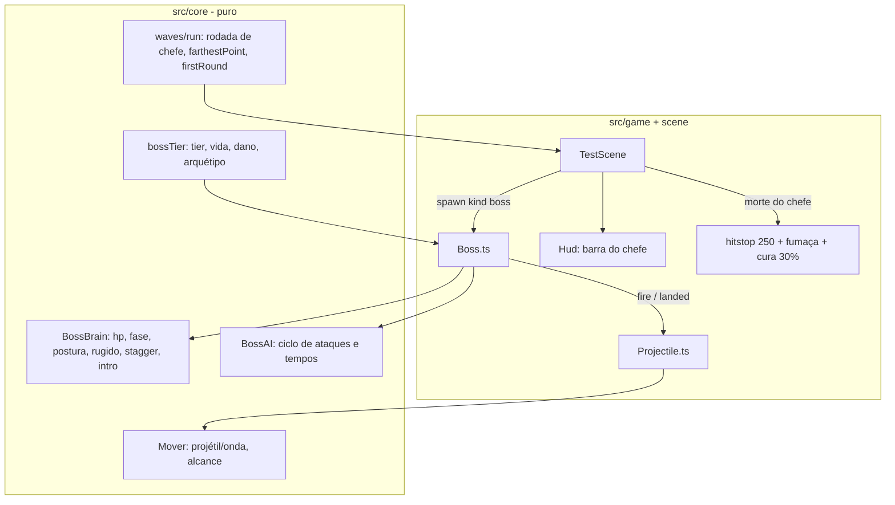

# Boss a cada 5 rodadas — Design

**Spec**: `.specs/features/boss-a-cada-5/spec.md`
**Status**: Approved (abordagem decidida pelo agente por delegação do usuário)

---

## Abordagem

**Escolhida: cérebro do chefe puro no core, corpo no Phaser.** Mesmo padrão da F1 e da IA do inimigo. Duas classes em `src/core` recebem `dt`, observações e golpes, e devolvem saídas e eventos:
- `BossBrain`: vida, fases, postura, rugido, atordoamento e entrada.
- `BossAI`: ciclo de ataques, tempos, investida, salto e rajada.

O adaptador `Boss.ts` só move o corpo, abre hitboxes e cria projéteis.

Alternativas descartadas:
- **Estender o `EnemyAI`/`EnemyBrain` existente com flags de chefe.** Mistura dois comportamentos numa classe já verificada e arrisca regressão nos testes AI-01..06.
- **IA do chefe dentro do adaptador Phaser, com timers e tweens.** Tempos e fases ficariam só no smoke, o que viola o AD-001.



---

## Code Reuse Analysis

| Component | Location | How to Use |
| --- | --- | --- |
| `Run`, `WaveSpawner`, `waveSize` | `src/core/run.ts`, `src/core/waves.ts` | A rodada múltipla de 5 vira uma onda de tamanho 1 com `kind: 'boss'`; o comando `spawn` ganha `kind` |
| `Hit`, `canDamage`, `makeHitGate` | `src/core/hit.ts` | Golpes do chefe e dos projéteis (time `enemy`) |
| `AttackHitbox` | `src/game/hitbox.ts` | Hitbox da investida (aberta durante o movimento) e do pouso (um frame) |
| `tagBody`, `Hittable`, `routeContact` | `src/game/bodyTags.ts` | O chefe é `Hittable`; os projéteis detectam parede e player pelo roteamento de contato |
| `Health.heal` | `src/core/health.ts` | Cura de 30% na vitória (BWIN-01) |
| `Hitstop`, `Fx.shake`, `Fx.curseSmoke` | `src/core/hitstop.ts`, `src/game/fx.ts` | Efeitos da derrota (BWIN-02/03) |
| `Hud` (`banner`, `uiLayer`, `css()`) | `src/game/Hud.ts` | Barra do chefe e faixas `Chefe: <nome>` e `Chefe derrotado!` |
| `debugApi` + smoke | `src/game/debugApi.ts`, `scripts/smoke/` | `snapshot().boss`; cenário `boss.smoke.mjs` |
| Pipeline de arte em grade | `src/game/art/` (AD-002) | Sprites do chefe, projétil e onda; a Tecelã é a mesma grade com outro mapa de cores |
| Skill `phaser-gamedev` | `.claude/skills/phaser-gamedev` | Consulta dos workers sobre corpos Matter cinemáticos e sensores |

---

## Components

### bossTier (`src/core/bossTier.ts`)
- `tierFor(round): number`, igual a `round / 5` (só para rodadas de chefe).
- `bossHpFor(tier, t)`, `bossDamageMultFor(tier, t)` e `archetypeFor(tier): 'oni' | 'tecela'`.
- `bossSpecFor(round, t): BossSpec`. Devolve nome, arquétipo, maxHp, danos (investida, pouso, onda, projétil), velocidade do projétil e contagem da rajada (BTIER-01..07).

### BossBrain (`src/core/bossBrain.ts`)
- **Estado**: `intro | active | roar | stagger | dead`. Também guarda `hp`, `maxHp`, `phase` (1..3) e `poise`.
- **`receiveHit(hit): BossEvent[]`**:
  - Na `intro` e no `roar` não perde hp (BOSS-08, BAI-12).
  - Tira postura de acordo com o golpe: `dano` no leve, `2 × dano` no forte (BAI-07). Postura em 0 leva ao `stagger` (BAI-08).
  - Ao cruzar 66% ou 33% da vida, emite `phaseChanged` e entra em `roar`. Cada limiar dispara uma vez só (BAI-01, BAI-05, BAI-06). Se o chefe estava em `stagger`, o `roar` vence.
  - Ao zerar a vida, emite `died`.
  - Nunca produz hitstun nem ragdoll (BAI-10, BAI-14).
- **`update(dt): BossEvent[]`**:
  - Conta 1500 ms de `intro`, 900 ms de `roar` e 1200 ms de `stagger`.
  - Regenera a postura a 15/s depois de 2000 ms sem apanhar (BAI-09).
  - Eventos que emite: `introEnd`, `roarStart`, `roarEnd`, `staggerStart`, `staggerEnd`.

### BossAI (`src/core/bossAI.ts`)
- `update(dt, obs: { selfX, playerX, blocked, canAct, phase, spec }): BossAIOutput`.
- `BossAIOutput = { vx, leap: { fromX, toX, progress } | null, state, attack, events }`.
- `state` vai de `rest` para `windup`, depois `charge`, `leap` ou `volley`, e volta a `rest`.
- **Ciclo por fase** (BAI-02): recomeça do primeiro ataque quando a fase muda. O preparo é multiplicado por `m` (BAI-03) e o descanso vem por fase (BAI-11).
- **Investida** (BAT-01/09):
  - no fim do preparo, fixa a direção do player; se o player estiver no mesmo x, usa o lado para onde o chefe olha (edge case);
  - `vx = ±320` até percorrer 360 px, somados por `dt`, ou até `blocked`;
  - eventos `hitboxOn` e `hitboxOff`.
- **Salto** (BAT-02/10/03):
  - fixa o x do player no fim do preparo;
  - o `progress` vai de 0 a 1 em 700 ms;
  - no fim emite `landed`, que abre a hitbox de pouso e cria as ondas.
- **Rajada** (BAT-04, BTIER-05/07): emite `fire { dir, speed }` a cada 150 ms, `spec.volleyCount` vezes.
- **Interrupção**: sem `canAct` (intro, rugido, atordoamento), fecha qualquer hitbox (evento `hitboxOff`), cancela o ataque e fica parado (BAI-05, BAI-08).

### Mover (`src/core/mover.ts`)
- `new Mover(x, dir, speed, maxDist)`, `update(dt): 'moving' | 'expired'`, getters `x` e `traveled`.
- Serve para os projéteis (1200 px) e para as ondas (600 px) (BAT-12).

### Rodada de chefe (`src/core/waves.ts`, `src/core/run.ts`)
- `isBossRound(round)`. O `WaveSpawner` numa rodada de chefe tem tamanho 1 e ordem `kind: 'boss'` (BOSS-01/02).
- `farthestPoint(points: {x}[], playerX): number`: maior `|x − playerX|`, desempate pelo menor índice (BOSS-03).
- O `Run` repassa `kind` no comando `spawn`. Ganha também `firstRound` opcional no construtor, usado só em `?debug&round=N` para o smoke começar na rodada 5.

### Adaptadores
- **`Boss.ts`**:
  - É `Hittable`, com corpo Matter de 40×56 px, inércia infinita e fricção.
  - Durante o salto fica sem gravidade e com a posição roteirizada: x interpolado e arco de 120 px de altura.
  - Usa `AttackHitbox` para a investida e o pouso.
  - Dispara callbacks `onFire`, `onLanded`, `onRoar` (a cena aplica o impulso de 6 px/step no player) e `onDied`.
  - Toca a animação de preparo de cada ataque.
  - Sem hitbox aberta, o contato não causa dano (BAT-08/13).
- **`Projectile.ts`**:
  - Sensor Matter sem gravidade, movido pelo `Mover`.
  - Acerta o player com `canDamage`.
  - Some ao tocar parede ou player, ou quando expira (BAT-06).
  - A onda de choque é um `Projectile` rente ao chão, com 20 px de altura.
- **Arte (`src/game/art/sprites/boss.ts`)**:
  - Frames `idle`, `windup-charge`, `charge`, `windup-leap`, `leap`, `windup-volley`, `volley`, `roar`, `stagger`, `dead`.
  - Frames de projétil e de onda.
  - `TECELA_COLOR_MAP` remapeia as letras para outras cores da paleta (BTIER-06).
- **`Hud.ts`**:
  - `showBossBar(name)`, `setBossHp(hp, max)`, `hideBossBar()`.
  - Barra de 400 px no topo com marcas em 66% e 33%.
  - Constantes de cor da paleta exportadas (BHUD-06).
  - `debugState` ganha `bossBar: { visible, fillWidth, name }` e `bossBarIgnoredByMain`.
- **`TestScene.ts`**:
  - Faz o spawn por `kind`, usando `farthestPoint` para o chefe.
  - Mantém uma lista de projéteis.
  - Na vitória: cura de 30%, hitstop de 250 ms (`BOSS_DEFEAT_HITSTOP_MS` em `src/data/fx.ts`), tremida, fumaça e o evento `bossDefeatedFx`.
  - O snapshot ganha `boss` (BHUD-04) e `projectiles`.
  - `startRun` também remove o chefe e os projéteis (edge case).

---

## Data Models

```typescript
type BossArchetype = 'oni' | 'tecela';
interface BossSpec {
  name: string; archetype: BossArchetype; maxHp: number;
  damage: { charge: number; leap: number; shockwave: number; projectile: number };
  projectileSpeed: number; volleyCount: number;
}
type BossBrainState = 'intro' | 'active' | 'roar' | 'stagger' | 'dead';
type BossAttack = 'charge' | 'leap' | 'volley';
type BossEvent =
  | { type: 'introEnd' } | { type: 'phaseChanged'; phase: 2 | 3 } | { type: 'roarStart' } | { type: 'roarEnd' }
  | { type: 'staggerStart' } | { type: 'staggerEnd' } | { type: 'died' };
// snapshot.boss: { hp, maxHp, phase, state, attack, poise, archetype, name } | null
```

---

## Error Handling Strategy

| Error Scenario | Handling | User Impact |
| --- | --- | --- |
| Golpe durante a intro ou o rugido | Ignorado sem perder hp (BOSS-08, BAI-12) | O jogador vê o chefe "brilhar" e sem dano, sinal claro de invulnerável |
| Chefe preso na parede durante a investida | `blocked` encerra a investida (BAT-01) | Nada trava |
| Projétil sem colisão | Expira pelo alcance (BAT-12) | Sem lixo acumulado |
| Nova run com chefe vivo | `startRun` destrói o chefe e os projéteis | Tela limpa |

---

## Risks & Concerns

| Concern | Location (file:line) | Impact | Mitigation |
| --- | --- | --- | --- |
| Salto com corpo Matter pode colidir no ar e travar | novo `Boss.ts` | Chefe preso | Durante o salto o corpo vira sensor sem gravidade, com posição roteirizada; volta ao normal no pouso |
| Hitstop de 250 ms acumulado com o golpe fatal (90 ms) | `src/scenes/TestScene.ts` (`onConnect`) | Congelamento maior que o previsto | Na morte do chefe o hitstop é fixado em 250 ms (`trigger` com o maior valor) |
| Muitos projéteis em cena | novo `Projectile.ts` | Queda de fps | No máximo 5 por rajada; expiram por alcance |
| Smoke precisa chegar à rodada 5 | `scripts/smoke/` | Cenário lento (limpar 4 rodadas) | `?debug&round=N` começa a run na rodada N |
| Arte grande em grade de texto | `src/game/art/sprites/boss.ts` | Task longa | Um frame-base e variações por deslocamento; a Tecelã reaproveita a grade |

---

## Tech Decisions

| Decision | Choice | Rationale |
| --- | --- | --- |
| Separar vida/fase (`BossBrain`) de ataques (`BossAI`) | Duas classes puras | Cada uma testável isoladamente, como `EnemyBrain` e `EnemyAI` |
| Ordem dos ataques | Fixa por fase, sem RNG | Aprendível (diversão) e determinística nos testes |
| Onda de choque | Um `Projectile` rente ao chão | Reaproveita o mesmo mover e a mesma colisão |
| Começar em outra rodada | `?debug&round=N` | Smoke rápido; não existe fora do debug |
