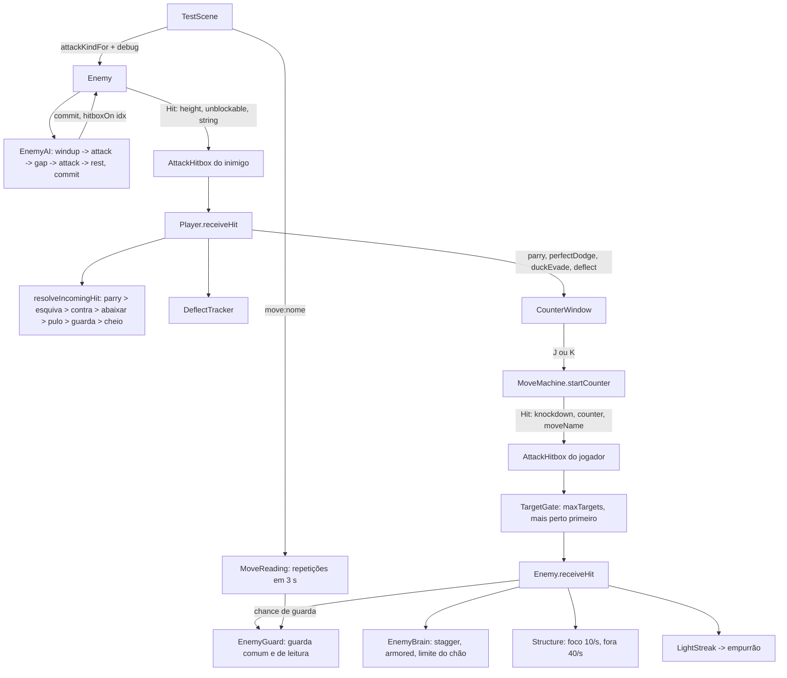

# Combate de Mestre — Design

**Spec**: `.specs/features/combate-mestre/spec.md`
**Status**: Approved (o usuário pediu para seguir com as próximas features sem consulta; valida no UAT)
**Branch**: `feat/combate-mestre`

Decisões ativas respeitadas:
- AD-001: toda regra nova é pura, em `src/core`/`src/data`, testada em Node; `src/game` e a cena só ligam.
- AD-002: a arte nova (marcador e frames do jogador) é grade de texto validada pelo `parseSheet`.
- AD-003: marcador e textos flutuantes são do mundo; nada novo entra na `uiLayer`.
- AD-006: os sorteios novos (guarda de leitura, empurrão) usam o stream de guarda da run; com chance 0 ou 1 o stream não é consumido (`Rng.chance`).
- AD-014: HP e dano não mudam.
- AD-015: é a decisão que esta feature implementa (postura no centro, `maxTargets`, limite do chão).
- AD-016: o limitador de 2 atacantes da F11 continua; a sequência do inimigo ocupa a mesma vaga do começo ao fim.
- AD-019: o marcador segue a posição de desenho do inimigo (`BodyRenderPos`), não o corpo.

Decisões novas (em `STATE.md`): **AD-020** (contrato do golpe inimigo: tipo, marcador, compromisso e sequência no `Hit`; emenda a AD-013) e **AD-021** (só `Hit.knockdown` derruba quem sobrevive; golpe de técnica fica fora das regras da AD-015).

Lições confirmadas aplicadas:
- **L-010:** cada limiar é testado dos dois lados: 200 ms do compromisso, 380 e 220 ms do cambaleio, 300 ms da invulnerabilidade, 320 ms do abaixar, 450 e 900 ms do Contra, 3000 ms da leitura, 1500 ms da sequência de leves, 4 leves, 80 px da leitura, `maxTargets`.
- **L-043:** além do helper puro, o smoke confere a chamada do adaptador (o `Hit` que o inimigo abre, o frame do marcador desenhado, a postura que cai no abaixar).

---

## Abordagens consideradas

| | Abordagem | Veredito |
| --- | --- | --- |
| **A (escolhida)** | Estender os módulos puros que já existem e marcar o golpe com dados: o `Hit` ganha `height`, `knockdown`, `tech`, `counter` e `string`; `EnemyBrain`, `EnemyAI`, `resolveIncomingHit`, `Structure`, `EnemyGuard` e `MoveMachine` recebem o que precisam por parâmetro. Módulos novos só onde não há dono: tipo do golpe, janela de Contra, abaixar, Deflexão, leitura e portão de alvos. | Mantém as costuras que os 1780 testes usam. Cada regra tem um dono puro e um ponto de ligação. A F14 reescreve a IA e só precisa manter o contrato do `Hit` (AD-020). |
| B | Um `CombatResolver` central em `src/core` que decide tudo (defesa do jogador e reação do inimigo) numa função só. | Obriga a reescrever `Player.receiveHit` e `Enemy.receiveHit` de uma vez, com regressão em toda a F7. Ganho pequeno: as duas decisões não compartilham estado. |
| C | Altura por física: encolher a hurtbox ao abaixar e baixar a hitbox do golpe `low`. | O sensor do Matter dispara no `collisionstart` e alarga o AABB pela velocidade (ver `Player.touchesTerrain`); o resultado dependeria do passo de física. Por regra, o desfecho é uma função pura testável. |

---

## Architecture Overview



---

## Code Reuse Analysis

| Componente | Local | Uso |
| --- | --- | --- |
| `Hit`, `makeHitGate` | `src/core/hit.ts` | `Hit` ganha campos; `makeHitGate` fica para quem não tem limite (inimigo, projétil); `TargetGate` novo ao lado |
| `EnemyBrain` | `src/core/enemyBrain.ts` | Estado `stagger`, contexto `committed`, limite do chão, `forceStagger`, `recover` |
| `EnemyAI` | `src/core/enemyAI.ts` | Sequência (`hits`, `stringGapMs`), compromisso (`commitMs`), evento `commit` |
| `Guard`, `resolveIncomingHit` | `src/core/defense.ts` | Ordem nova de decisão; `Guard` não muda |
| `Dodge` | `src/core/dodge.ts` | Não muda; o abaixar é uma classe irmã (`Duck`) e a recarga é o maior dos dois relógios |
| `Structure` | `src/core/structure.ts` | `reduce(n)` e taxa de queda por parâmetro em `update` |
| `EnemyGuard` | `src/core/enemyGuard.ts` | Guarda de leitura (`read`), que segura forte uma vez; a chance passa a vir de `guardChance` |
| `MoveMachine` | `src/core/moveMachine.ts` | `startCounter`, `endActive`, `recovery` de quem errou (`whiffRecoveryMs`) |
| `AttackHitbox` | `src/game/hitbox.ts` | Troca o portão por `TargetGate` quando recebe `maxTargets`; decide os alvos no fim do evento de colisão |
| `routeContact` | `src/game/bodyTags.ts` | `routeContacts(pairs)` novo: roteia todos os pares e depois roda a fila adiada |
| `PropMachine.tryHit` | `src/core/props.ts` | Portão com teto 2 no balanço |
| `FloatTexts` | `src/game/FloatTexts.ts` | Textos `CONTRA` e `DEFLEXÃO` |
| `FxTimeline` (`realtimeFx.add`) | cena | Camada `counter.ready` |
| `pose`, `armStraight`, `armRaised`, `LEGS_WIDE` | `src/game/art/sprites/player.ts`, `playerMoves.ts` | Frames `duck`, `contra-*` e `contraGancho-*` com as partes que já existem |
| `fxStar` e moldura de barra do inimigo | `src/game/Enemy.ts` | O marcador fica na mesma profundidade e segue a posição de desenho |
| `debugParam`, `debugIntParam` | `src/scenes/TestScene.ts` | Chaves `enemyAttack`, `enemyString`, `shove` |
| `makeKit` | `scripts/smoke/fight-kit.mjs` | Ganha `shove=0` por padrão e ajudantes para esperar o compromisso |

---

## Components

### 1. Golpe e portão de alvos — `src/core/hit.ts`

```ts
export type HitHeight = 'high' | 'low';
export interface HitString { id: number; index: number; length: number } // index a partir de 1

export interface Hit {
  // ...campos atuais
  height?: HitHeight;      // ausente = corpo inteiro (não dá para abaixar nem pular)
  knockdown?: boolean;     // derruba o inimigo comum que sobrevive (AD-021)
  tech?: boolean;          // golpe de técnica: fora do limite do chão
  counter?: boolean;       // Contra: cambaleia mesmo o inimigo comprometido
  string?: HitString;      // golpe de uma sequência de inimigo
}

/** O alvo conta ao chamador que segurou o golpe com a guarda (TGT-06). */
export interface HitReport { blocked?: boolean }

export type TargetOutcome = 'accepted' | 'blocked' | 'refused';

export class TargetGate {
  constructor(ownerId: number, maxTargets: number)
  wants(targetId: number): boolean                 // não é o dono, ainda não foi tentado e sobra vaga
  note(targetId: number, o: TargetOutcome): void   // accepted e blocked gastam vaga; refused não (TGT-05)
  get slotsLeft(): number
}

/** TGT-04: ordena por distância horizontal e, no empate, por id. */
export function orderTargets<T extends { id: number; dist: number }>(c: readonly T[]): T[]
```

`Hittable.receiveHit(hit, report?)` ganha o segundo parâmetro opcional. Só `Enemy` o preenche (`report.blocked = true` no bloqueio). O retorno continua `boolean` (aceito), então nenhum chamador antigo muda.

### 2. Tipo do golpe inimigo — `src/core/attackKind.ts` (novo)

```ts
export type AttackKind = 'white' | 'red' | 'low';
export function attackKindFor(i: { variant: EnemyVariant; weapon: ToolKey | null }): AttackKind  // HGT-01..03
export function hitFieldsFor(kind: AttackKind): Pick<Hit, 'height' | 'unblockable'>            // HGT-04..06
export function parseAttackKind(s: string | null | undefined): AttackKind | null               // HGT-13, EDG-08
export function parseStringLength(s: string | null | undefined): number | null                 // DFL-14, EDG-09 (inteiro de 1 a 4)
export const KIND_COLOR: Record<AttackKind, string> = { white: 'w', red: 't', low: 'A' }      // CMT-02
```

`EnemyBase.attack` vira `EnemyAttackDef = AttackStep & { kind: AttackKind }` (`ENEMY_ATTACK.kind = 'white'`). A cena resolve o tipo depois do `armFor`: `kind = parseAttackKind(debug) ?? attackKindFor({ variant, weapon })`.

### 3. IA: compromisso e sequência — `src/core/enemyAI.ts`

- **Tuning novo** em `EnemyAITuning`: `commitMs: 200`, `stringGapMs: 300`, `hits: 1`. `armFor` da faca põe `hits: ARMED.knife.hits` (2); a cena aplica `parseStringLength(debug)` por cima.
- **Máquina:** `windup` (windupMs) → `attack` (golpe 1) → se há próximo golpe: `windup` de `stringGapMs` (DFL-02, DFL-03) → `attack` (golpe seguinte) → … → `rest` depois do último (DFL-04). A sobra do frame continua passando de fase em fase (`next`), então os tempos são exatos.
- **Eventos:** `windupStart` só no primeiro preparo (DFL-06); `commit` uma vez, quando o tempo do primeiro preparo cruza `commitMs` (CMT-01/02); `hitboxOn` e `hitboxOff` por golpe.
- **Getters:** `committed` = (`windup` com `timer ≤ commitMs` ou em sequência já iniciada) ou `attack`; `hitIndex` (0 fora de golpe, a partir de 1 dentro) e `hits`.
- **`interrupt()`** zera a sequência (EDG-05).

### 4. Cérebro: cambaleio, armadura e chão — `src/core/enemyBrain.ts`

- `EnemyState` ganha `'stagger'`. `EnemyTuning` ganha `staggerMs: 380`.
- `EnemyEvent` ganha `{ type: 'stagger'; hit }` e `{ type: 'armored'; hit }`.
- `receiveHit(hit, ctx: { committed?: boolean; ragdollStunMs?: number })`, nesta ordem:

| Condição | Efeito |
| --- | --- |
| morto | `[]` |
| `gettingUp` e não `hit.tech` | `[]`, recusado (GND-03) |
| `ragdollStun`, não `hit.tech`, `downHits ≥ 1` | `[]`, recusado (GND-02) |
| `ragdollStun`, não `hit.tech`, `downHits = 0` | `downHits = 1`, dano; morreu → `died` + `ragdoll`; senão `hurtWhileDown`, sem mexer no relógio (GND-01, GND-06) |
| dano leva o hp a 0 | `deadRagdoll`, `died` + `ragdoll` |
| `hit.knockdown` | `ragdollStun` (relógio do golpe ou do tuning), `ragdoll`; `downHits` volta a 0 só se veio de outro estado (GND-05, GND-07) |
| `ctx.committed` e não `hit.counter` | estado fica `idle`, `armored` (CMT-04, CMT-06) |
| `heavy` | `stagger` por `staggerMs`, `stagger` (PST-01, PST-11, CNT-21) |
| `light` em `stagger` | fica `stagger`, relógio = `max(resto, hitstunMs)`, `hitReaction` (PST-10) |
| `light` em `ragdollStun` (técnica) | `hurtWhileDown` |
| `light` | `hitstun`, `hitReaction` |

- `forceStagger(ms)`: põe em `stagger` por `ms` se está vivo e fora de ragdoll (DFL-11).
- `recover()`: de `hitstun` ou `stagger` para `idle`; devolve se mudou (RDG-09, RDG-22).
- `get downHits()`.

O inimigo quebrado continua tratado no adaptador: `Enemy.receiveHit` troca o golpe por `{ strength: 'light', force: 0, knockdown: false }` quando `wasBroken && !isFinisher` (EDG-11).

### 5. Defesa do jogador — `src/core/defense.ts`, `src/core/duck.ts` (novo), `src/core/counter.ts` (novo)

```ts
export type HitOutcome = 'parry' | 'dodged' | 'countered' | 'ducked' | 'jumped' | 'block' | 'hit';

export interface IncomingHit {
  hit: Pick<Hit, 'damage' | 'unblockable' | 'height'>;
  attackerInFront: boolean; isBoss: boolean; guard: GuardState;
  dodgeInvulnerable: boolean;
  counterInvulnerable: boolean;   // Contra em startup ou active (CNT-11)
  ducking: boolean;               // DEF-11
  airborne: boolean;              // DEF-17
}
```

`resolveIncomingHit` segue a ordem do DEF-20. O parry passa a exigir `attackerInFront && !hit.unblockable` (DEF-01, DEF-02).

```ts
/** Abaixar (DEF-07..15): parado por 320 ms; a recarga de 450 ms conta do início. */
export class Duck {
  constructor(t = DUCK)                 // { durationMs: 320, cooldownMs: 450, evadePosture: 10 }
  start(): void; update(dtMs: number): void; reset(): void
  get active(): boolean                 // elapsed < durationMs (EDG-06: em 320 ms já não vale)
  get cooldownMs(): number
  registerEvade(): boolean              // true só na primeira vez de cada abaixar (DEF-12)
}

/** Deflexão (DFL-10, DFL-12, DFL-16): conta os parries por id de sequência. */
export class DeflectTracker {
  onParry(s: HitString | undefined): boolean   // true no parry do último golpe com todos os anteriores aparados e length >= 2
  reset(): void
}

/** Janela de Contra (CNT-01..08, CNT-13, CNT-20): relógio de jogo, avança em update(dt). */
export class CounterWindow {
  open(kind: 'contra' | 'contraGancho', ms: number): void   // substitui a janela em curso (CNT-13)
  update(dtMs: number): void
  buffer(): void                    // aperto guardado durante esquiva ou abaixar (CNT-07)
  take(free: boolean): 'contra' | 'contraGancho' | null     // consome se aberta e (aperto agora ou guardado) e free
  close(): void
  get isOpen(): boolean; get kind(); get remainingMs(): number
}
```

`Structure.reduce(amount)`: baixa `cur` até 0; quebrada, não muda; não mexe no relógio de queda. `Structure.update(dtMs, decayPerSec = tuning.decayPerSec)`: a taxa entra por parâmetro (PST-14, PST-16).

### 6. Golpes do jogador — `src/data/moves.ts`, `src/core/moveMachine.ts`

- `MoveDef` ganha `maxTargets: number`, `knockdown?: true`, `postureCost?: number`, `counter?: true`, `whiffRecoveryMs?: number`, `bounce?: { backPx: number; ms: number; vy: number }`.
- Valores: TGT-01/02; `knockdown` em `rasteira`, `ganchoAscendente`, `palmaExplosiva` (PST-04); `voadora`: `postureCost: 15`, `whiffRecoveryMs: 460`, `bounce: { backPx: 36, ms: 150, vy: -240 }`.
- Golpes novos `contra` e `contraGancho` (CNT-09/10), com `input: { via: 'counter' }` (novo valor de `MoveInput`), `followUps: {}`, hitbox `FIST` e a do `ganchoAscendente`.
- Constantes novas: `DUCK`, `COUNTER = { windowMs: 450, deflectWindowMs: 900, deflectStaggerMs: 900 }`, `READING = { windowMs: 3000, perRepeat: 0.25, rangePx: 80, streakMin: 4, streakGapMs: 1500, shoveChance: 0.35, shovePx: 48, shoveMs: 150, shoveLockMs: 300 }`, `STRUCTURE.enemy.offFocusDecayPerSec = 40`, `STRUCTURE.player.evadeRelief = 10`. `DEFENSE.guardSpeedFactor` passa a 0 (DEF-05).
- `MoveMachine`:
  - `startCounter(name)`: começa o golpe se não há golpe em curso; devolve os eventos.
  - `endActive()`: em `active`, passa para `recovery` com `recoveryMs` e emite `hitboxOff` (VOA-04, VOA-09).
  - No fim natural de `active`, sem acerto e com `whiffRecoveryMs`: `recovery` dura `whiffRecoveryMs` e sai o evento `{ type: 'whiff', move }` (VOA-07, VOA-08).

### 7. Leitura — `src/core/moveReading.ts` (novo), `src/core/enemyGuard.ts`

```ts
export class MoveReading {
  note(move: string, nowMs: number): number   // devolve as repetições (inícios do mesmo golpe nos 3000 ms anteriores) e guarda o início (RDG-01)
  get last(): { move: string | null; repeats: number }
  reset(): void
}
export function readingBonus(repeats: number): number                    // min(0,25 × repeats, 1) (RDG-02)
export function guardChance(i: { base: number; reading: number; override?: number; baseConditions: boolean }): number  // RDG-03, RDG-10

export class LightStreak {
  onLight(nowMs: number): number     // RDG-13, RDG-14
  onHeavy(): void                    // RDG-15
  reset(): void
  get count(): number
}
```

`EnemyGuard`: `raise(read: boolean)`, `get read()`; `resolveHit` com a guarda de leitura segura `heavy` sem `unblockable` (0 de dano, +8, guarda termina: RDG-06..08). `onPlayerLightMove` dá lugar a `tryRaise(chance, read)`: com chance 0 não sorteia (RDG-04).

### 8. Adaptadores

**`src/game/hitbox.ts` e `src/game/bodyTags.ts`**
- `routeContacts(pairs)` roteia todos os pares e depois roda as funções registradas por `deferContact(fn)`.
- `AttackHitbox.open(shape, hit, x, y, facing, maxTargets?)`: sem `maxTargets`, o comportamento de hoje. Com ele, o `onTouch` só junta os candidatos; a função adiada os ordena com `orderTargets` (distância ao `x` do dono) e, para cada um com vaga, chama `receiveHit(hit, report)` e `gate.note` (TGT-03..06).

**`src/game/Enemy.ts`**
- Marcador: sprite `TEX.fxTelegraph` sobre a cabeça, visível com a IA em `windup` ou `attack`, no frame do tipo (HGT-07, HGT-08); segue `drawPos`.
- Flash: no evento `commit`, `setTintFill(PALETTE[KIND_COLOR[kind]])` por 80 ms (`scene.time`, que para no hitstop); `commitFlash` no snapshot.
- `openAttack`: `{ ...hitFieldsFor(kind), string: { id, index, length } }`; o id muda a cada `windupStart`.
- `receiveHit(hit, report?)`: guarda → cérebro com `{ committed: ai.committed }` → se o evento é `armored`, a IA não é interrompida e sai `armored:<id>`; `stagger` usa a pose `impact` e o impulso do golpe; depois postura, sequência de leves e empurrão.
- `update(dt, playerX, frame)`: `frame.focus` escolhe a taxa de queda da postura.
- `onPlayerMove(player, move, round, { repeats, override })`: elegibilidade do Glossário, `guardChance`, `guard.tryRaise`; guarda de leitura chama `brain.recover()` (RDG-09) e emite `read:<id>`.
- `parried({ final, deflect })`: +35 sempre; não final → nada mais (DFL-07, DFL-08); final → 400 ms parado (DFL-09); `deflect` → `brain.forceStagger(900)` (DFL-11).
- Empurrão: `onShove(dir)` avisa a cena; `brain.recover()`; `shove:<id>`.

**`src/game/Player.ts`**
- `receiveHit`: monta `IncomingHit` com `ducking`, `airborne` e `counterInvulnerable`; trata `ducked` (`duckEvade`, −10, janela `contraGancho`), `jumped` (`jumpEvade`), `countered` (nada), `parry` (Deflexão, janela, `attacker.parried(info)`), `perfectDodge` (−10, janela).
- `tryDodge`: com `S`, começa o `Duck` (DEF-07, DEF-22); recarga = maior entre `dodge.cooldownMs` e `duck.cooldownMs` (DEF-15).
- `updateStrikes`: com a janela aberta e de mãos vazias, `J`/`K` no chão vira `startCounter` ou `buffer` (CNT-05, CNT-07, CNT-16..19).
- `onMove`: `moveStart` com `postureCost` soma postura (VOA-01..03); `whiff` emite `whiff:voadora`.
- `hitLanded()`: golpe com `bounce` em `active` → `moves.endActive()`, recuo por `scriptedDx` e `vy` (VOA-04..06).
- `shoved(dir)`: cancela o golpe, 48 px em 150 ms, 300 ms sem input (RDG-19..21).
- Guarda: `runSpeed × DEFENSE.guardSpeedFactor` com fator 0; o `facing` já segue a direção em `stepMovement` (DEF-04, DEF-05).
- Animação: frame `duck` no abaixar; os Contras usam `<golpe>-wind|hit|recover` como todo golpe do grafo.

**`src/game/Prop.ts`, `src/core/props.ts`**: portão com teto 2 no balanço (TGT-07); `propHit` do arremesso com `knockdown: true` (PST-07). O `onConnect` passa o alvo como terceiro argumento, para o foco.

**`src/game/TechRunner.ts`**: todo `Hit` criado ali ganha `tech: true`; os `heavy`, também `knockdown: true` (PST-09, GND-04).

**`src/game/Projectile.ts`, `src/game/Boss.ts`**: `height: 'high'` no projétil, `'low'` na onda; investida e pouso sem `height` (HGT-10..12).

**`src/scenes/TestScene.ts`**
- `onPlayerMoveStart`: ignora golpe `counter`; `reading.note`; chama `e.onPlayerMove` em todos.
- Foco: `focusId` no acerto corpo a corpo ou de objeto num inimigo comum e no finalizador (PST-13); o finalizador e a tecla 2 do debug levam `knockdown: true` (PST-06, PST-12).
- `onDefense`: `CONTRA` e `DEFLEXÃO` nos textos flutuantes; camada `counter.ready` a cada frame com a janela aberta.
- `listenForContacts` usa `routeContacts`.
- Debug: `enemyAttack`, `enemyString`, `shove`; `enemyGuard` como override total. Snapshot com os campos do contrato da spec. `startRun` zera leitura e foco (EDG-01..04).
- `controlsLines`: linha com `S+Q abaixar` (DEF-21).

### 9. Arte

- **`src/game/art/sprites/telegraph.ts`** (novo): `TELEGRAPH_FRAMES = { white, red, low }`, 7×7 texels: `!` em `w`, `×` em `t`, `▼` em `A`, contorno `k` (HGT-09). Textura `TEX.fxTelegraph`.
- **`src/game/art/sprites/playerMoves.ts`**: `duck` (corpo agachado, braços recolhidos, mesma base do `socoBaixo-wind`), `contra-wind|hit|recover` (soco reto curto, tronco à frente) e `contraGancho-wind|hit|recover` (sobe do agachado com o braço erguido do `ganchoAscendente`). Passam pelo `parseSheet` e pelos testes de `playerConsistency` (SPF) (CNT-17).

---

## Data Models

```ts
type EnemyState = 'idle' | 'hitstun' | 'stagger' | 'ragdollStun' | 'gettingUp' | 'deadRagdoll' | 'dissolving' | 'gone';
type AIEvent = 'windupStart' | 'commit' | 'hitboxOn' | 'hitboxOff' | 'wantAttack';
interface EnemyAITuning { /* ...atuais */ commitMs: number; stringGapMs: number; hits: number }
interface EnemyTuning { /* ...atuais */ staggerMs: number }
type EnemyAttackDef = AttackStep & { kind: AttackKind };
type MoveInput = /* ...atuais */ | { via: 'counter' };
interface EnemyFrameInput { granted: boolean; windupAllowed: boolean; holdRank: number; focus: boolean }
interface ParryInfo { final: boolean; deflect: boolean }
interface Attacker { x: number; isBoss: boolean; parried(info: ParryInfo): void }
type DefenseKind = 'block' | 'parry' | 'perfectDodge' | 'duckEvade' | 'jumpEvade' | 'deflect';
```

Campos novos do snapshot: os do contrato da spec, todos lidos do objeto vivo (`telegraph` é o frame do sprite do marcador visível; `commitFlash` é a cor do tint em curso).

---

## Error Handling Strategy

| Cenário | Tratamento | O que o jogador vê |
| --- | --- | --- |
| Parâmetro de debug inválido (`enemyAttack`, `enemyString`, `shove`) | `parse*` devolve `null`; vale a regra normal | Nada muda |
| Golpe chega a alvo que não pode apanhar (levantando, limite do chão) | `receiveHit` devolve `false`; sem faísca nem hitstop; não gasta vaga | O golpe passa sem efeito |
| Janela de Contra aberta e jogador sem poder agir (no ar, com objeto) | O aperto segue o caminho normal; a janela conta até fechar | Sai o golpe comum |
| Sequência interrompida | `EnemyAI.interrupt` zera a sequência; a hitbox aberta fecha | O inimigo para de bater |
| Custo da voadora quebra a postura | `onGuardBreak` cancela o golpe | Jogador atordoado 800 ms |

---

## Risks & Concerns

| Concern | Location | Impact | Mitigation |
| --- | --- | --- | --- |
| Testes que fixam regras substituídas (forte derruba, parry de qualquer lado, 700 ms, guarda a 40%) | `tests/core/enemyBrain.test.ts`, `defense.test.ts`, `health.test.ts`, `enemyGuard.test.ts`, `hit.test.ts` | Falham ao mudar a regra | Cada task que troca a regra reescreve os casos do AC antigo citado na tabela "ACs antigos substituídos" da spec, no mesmo commit, e diz isso na mensagem. Nenhum outro teste é afrouxado |
| Smokes que contam com ragdoll no golpe forte, parry de costas ou guarda andando | `fight`, `defense`, `defense-extra`, `enemy-react`, `finisher`, `fight-integration`, `armed`, `run-loop`, `techniques`, `held-item`, `boss*` | Suíte vermelha no meio da feature | Uma task de smoke por fase roda a suíte inteira e ajusta só o que a tabela de ACs substituídos cobre. A tecla 2 do debug continua derrubando (PST-12), o que mantém a maioria |
| Empurrão sorteado em smokes antigos que dão 4 leves seguidos | `scripts/smoke/*` | Intermitência (L-042) | `makeKit.boot` acrescenta `shove=0` quando a query não traz `shove`; os smokes fora do kit que batem em inimigo comum recebem `shove=0` na URL |
| `hitLanded` e o empurrão mexem no jogador de dentro do passo de física | `src/scenes/TestScene.ts:1266`, `src/game/Player.ts` | Estado alterado entre dois `update` | Já é assim hoje (`hitLanded`); as mudanças só gravam campos lidos no `update` seguinte e `scriptedDx`, que o `onStep` aplica |
| Ordem dos pares do `collisionstart` não é garantida | `src/scenes/TestScene.ts:1569` | TGT-04 falharia sem ordenação | `routeContacts` adia a decisão para depois de todos os pares do evento; teste em Node com pares fora de ordem |
| `TestScene.ts` com 1576 linhas | `src/scenes/TestScene.ts` | Ligação difícil de revisar | Regra nova só em `src/core`; cada task de cena mexe num trecho (movimento do jogador, spawn, snapshot) |
| Smokes intermitentes conhecidos (`heal`, `armed`, `held-item`, `enemy-react`) | backlog do roadmap | Ruído no gate | Fora do escopo; rodar de novo isolado antes de tratar como regressão |
| Faca passa a dar 2 golpes | `src/core/armed.ts` | `armed.smoke` (ARM-12) mede o ciclo do inimigo armado | A task da sequência ajusta o smoke ao ciclo novo, sem mudar o dano |
| Frames novos do jogador precisam passar nos testes de consistência da F10 | `tests/game/playerConsistency.test.ts` | Arte recusada no gate | Compor com `pose` e as partes existentes; conferir com `tools/sprite-preview.mjs` |

---

## Tech Decisions

| Decision | Choice | Rationale |
| --- | --- | --- |
| Como o alvo avisa que bloqueou | Parâmetro de saída opcional `report` em `receiveHit` | Mudar o retorno para três valores tornaria `'blocked'` verdadeiro nos `if (receiveHit(...))` que disparam faísca e hitstop |
| Onde decidir os alvos do golpe | No fim do evento de colisão, numa fila adiada | É o único ponto em que todos os toques do passo são conhecidos |
| Abaixar | Classe `Duck` separada do `Dodge` | Não reabre os testes do `Dodge`; a recarga comum é o maior dos dois relógios |
| Sequência do inimigo | Volta a `windup` entre os golpes, sem estado novo | O limitador e o snapshot já tratam `windup|attack` como "atacando" |
| Golpe de técnica | Marcado com `tech: true` na origem | Uma marca no `Hit` evita que o cérebro precise conhecer o `TechRunner` |
| Guarda de leitura | Mesma `EnemyGuard`, com a marca `read` | Um só relógio de guarda; a diferença é segurar o forte uma vez |
