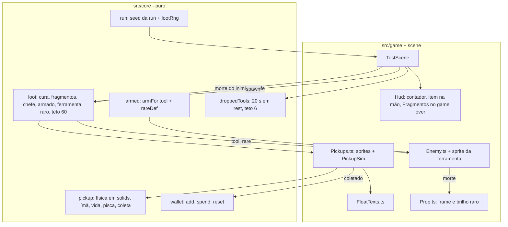

# Economia, drops e cura — Design

**Spec**: `.specs/features/economia-drops-cura/spec.md`
**Status**: Approved (abordagem decidida pelo agente por delegação do usuário)

---

## Abordagem

**Escolhida: regras puras no core; managers finos no Phaser.** É o mesmo padrão da F1 e da F2. Toda regra testável (sorteios, valores, física simples do pickup, ímã, tempos de vida, carteira, tuning do inimigo armado, ciclo de vida das ferramentas largadas) vive em `src/core`. O jogo só desenha e liga os eventos.

A física do pickup também é pura: gravidade e colisão com os retângulos `level.solids`, sem corpo Matter.

Alternativas descartadas:
- **Pickups como corpos Matter:**
  - pedem uma categoria de colisão nova e sensores;
  - o passo fixo do Matter já causou bug de velocidade (lição L-001);
  - o ímã, a gravidade e o "nunca dentro do sólido" ficariam só no smoke, contra o AD-001.
- **Crédito direto na carteira ao abater:** mais simples, mas contraria a decisão "fragmentos são objetos no chão" e tira o prazer da coleta.
- **Inimigo armado como classe nova:** o inimigo armado é o mesmo `Enemy` com outro tuning (`armFor`) e um sprite extra, o que não justifica duplicar a IA verificada.



---

## Code Reuse Analysis

### Existing Components to Leverage

| Component | Location | How to Use |
| --- | --- | --- |
| `Rng` (mulberry32) | `src/core/rng.ts` | Stream de loot próprio: `new Rng(seed ^ 0x9e3779b9)`; `int`, `chance` |
| `Run` | `src/core/run.ts:130` | Guardar a seed do `startRun` e criar o `lootRng` junto com o `rng` das ondas |
| `PropMachine`, `PropDef`, `validatePropDef` | `src/core/props.ts` | As ferramentas são `PropDef` novos; pegar, bater, arremessar e quebrar sem código novo |
| `Prop` | `src/game/Prop.ts` | Recebe um `frame` opcional (tool common/rare) e um `destroyNow()` |
| `Player.findPickup` / `interact` | `src/game/Player.ts:296,312` | Já pega qualquer `Prop` em `rest` da lista `props()` da cena |
| `Health.heal` | `src/core/health.ts` | A cura da gota, com teto (FND-05) |
| `scaleFor` | `src/core/difficulty.ts:53` | O `armFor` aplica a ferramenta **depois** da escala da rodada |
| `Fx.curseSmoke` | `src/game/fx.ts:125` | A ferramenta largada que some |
| `parseSheet` / `registerSheet` / `cutShards` | `src/core/pixelGrid.ts`, `src/game/art/render.ts`, `src/game/art/sprites/props.ts` | Grades dos cristais, da gota, das ferramentas e dos estilhaços |
| Snapshot e smoke | `src/game/debugApi.ts`, `scripts/smoke/lib.ts` | Campos novos e cenários novos |

### Integration Points

| System | Integration Method |
| --- | --- |
| Morte do inimigo comum | `Enemy` passa `armed` e `tool` no `onDied`; a cena chama `loot.enemyDrop(round, armed)` e cria os pickups e a ferramenta |
| Morte do chefe | `onBossDefeated` chama `loot.bossDrop(round)` (15 pickups, sem gota) |
| Spawn | `spawnFromCommand` chama `loot.rollArmed(round)` antes de criar o `Enemy` e passa `armFor(tool, scaled)` |
| Nova run | `onStartRun` zera a carteira e remove os pickups, os textos flutuantes e as ferramentas largadas |
| Game over | `applyRunCommand('gameOver')` acrescenta `Fragmentos: N` |

---

## Components

### `wallet` (novo)

- **Purpose**: A carteira de fragmentos da run.
- **Location**: `src/core/wallet.ts`
- **Interfaces**: `class Wallet { get fragments; add(n: number): void; spend(n: number): boolean; reset(): void }`. Um `add` com `n ≤ 0` ou não inteiro é ignorado.
- **Covers**: ECO-12, ECO-13, ECO-26, ECO-20, ECO-14.

### `loot` (novo)

- **Purpose**: Todos os sorteios da F3, numa ordem fixa, sobre o stream de loot.
- **Location**: `src/core/loot.ts`
- **Interfaces**:
  - `class Loot { constructor(rng: Rng, t: EconomyTuning, overrides?: LootOverrides) }`.
  - `enemyDrop(round, armed): { heal: boolean; fragments: number; value: number }`: sorteia a cura (`chance(healChance)`) e depois a quantidade (`int(2,4)` + 2 se armado).
  - `bossDrop(round): { heal: false; fragments: 15; value }`.
  - `rollArmed(round): { tool: ToolKey; rare: boolean } | null`: sorteia `chance(p)`, depois `int(0,1)` para a ferramenta e `chance(0.15)` para a raridade.
  - `fragmentValue(round) = 1 + floor((round − 1) / 5)`.
  - `armedChance(round) = round < 3 ? 0 : min(0.15 + 0.05·(round − 3), 0.5)`.
  - `capDrop(n, live, max = 60): { spawn: number; extraOnLast: number }`: o `extraOnLast` está em pickups; o valor extra é `extraOnLast × value`.
  - `burstVelocity(rng): { vx, vy }`: um sorteio de `int(−120, 120)` e outro de `int(−260, −180)`.
- **Overrides (debug)**: `{ armed?: ToolKey; healChance?: number; rare?: boolean }`. Com `armed`, `rollArmed` não sorteia a chance, mas ainda sorteia a raridade.
- **Covers**: ECO-01..05, ECO-15, ECO-28, HEAL-01, HEAL-02, HEAL-06, ARM-01..04, ARM-15, RAR-01, RAR-05.

### `pickup` (novo)

- **Purpose**: Estado e física de um pickup, sem Phaser.
- **Location**: `src/core/pickup.ts`
- **Interfaces**:
  - `interface PickupState { id; kind: 'fragment' | 'heal'; value; x; y; vx; vy; ageMs; magnet: boolean; speed; bounced: boolean; resting: boolean }`.
  - `stepPickup(p, dtMs, ctx: { solids: Rect[]; player: { x; y; w; h; alive: boolean; canHeal: boolean }; t: PickupTuning }): 'none' | 'collected' | 'expired'`.
  - `lifetimeMs(kind)` (15000 / 10000) e `visible(p)` (pisca de 150 ms nos últimos 3000 ms).
- **Física**: caixa de 8×8 px.
  - Integração semi-implícita com gravidade de 900.
  - Movimento em x, depois em y.
  - Ao entrar num sólido, recua para a borda: em y, o pickup assenta no topo e quica uma vez com `vy = −0,35·vy`; na segunda vez, para e zera `vx`. Em x, reflete com `vx = −0,5·vx`.
  - Em repouso, `vx` decai a 0.
- **Ímã**: entra quando `ageMs ≥ 300`, a distância entre os centros é ≤ 72, o player está vivo e (se for gota) `canHeal`.
  - Uma vez em ímã, fica: `speed = min(120 + 1200·t, 600)`, direção para o centro do player, sem colisão.
- **Coleta**: sobreposição da caixa com o retângulo do player, com o player vivo e, se for gota, com `canHeal`.
- **Covers**: ECO-06..11, ECO-18, ECO-21, ECO-24, ECO-25, HEAL-04, HEAL-05, HEAL-09.

### `armed` (novo)

- **Purpose**: O tuning do inimigo armado e as ferramentas.
- **Location**: `src/core/armed.ts` e `src/data/props.ts`
- **Interfaces**:
  - `armFor(tool: ToolKey, base: EnemyBase, t: ArmedTuning): EnemyBase`:
    - knife: `damage = round(1.25·d)`, `hitbox.width += 8`, `hitbox.offsetX += 4`;
    - club: `damage = round(1.6·d)`, `strength = 'heavy'`, `width += 12`, `offsetX += 6`, `ai.windupMs += 150`.
  - `rareDef(def: PropDef): PropDef`: `damage = round(1.5·d)`, `durability + 2`, `key = def.key + 'Rare'`, textura igual.
  - `PROP_DEFS.cursedKnife` e `PROP_DEFS.cursedClub`.
  - `PROP_NAMES: Record<string, string>` (Cadeira, Garrafa, Faca Amaldiçoada, Porrete Amaldiçoado); o nome do raro recebe o sufixo ` Rara`.
- **Covers**: ARM-05, ARM-06, ARM-07, ARM-11, ARM-20..24, RAR-02, RAR-04, RAR-06, ITEM-01, RAR-07.

### `droppedTools` (novo)

- **Purpose**: Tempo de vida e teto das ferramentas largadas.
- **Location**: `src/core/droppedTools.ts`
- **Interfaces**: `class DroppedTools {`
  - `admit(id, states: Map<id, PropState>): number | null` (id a remover para caber no teto de 6);
  - `update(dtMs, states): number[]` (ids que passaram 20000 ms em `rest`; o contador zera quando o estado sai de `rest` e recomeça ao voltar);
  - `forget(id)`; `clear() }`.
- **Covers**: ARM-13, ARM-14, ARM-18, ARM-28.

### `Run` (alterado)

- Guarda a seed do `startRun` e cria `lootRng = new Rng(seed ^ 0x9e3779b9)`, exposto por um getter.
- O `rng` das ondas não muda (ECO-17, ECO-31).

### `Pickups.ts` e `FloatTexts.ts` (novos, Phaser)

- `Pickups`: lista de `PickupState` mais um sprite por pickup.
  - `spawnDrop(x, y, kind, count, value, extraValue)` usa `burstVelocity`.
  - `update(dt, ctx)` chama `stepPickup`, move os sprites, aplica o pisca e devolve os coletados.
  - Também `clear()`, `liveFragments` e `debug()`.
  - Durante o hitstop a cena não chama `update`, então os pickups param junto.
- `FloatTexts`: texto do mundo que sobe 16 px em 400 ms e some, com a cor da paleta; `debug()` alimenta `floatTexts`.

### `Enemy.ts` (alterado)

- Recebe `weapon: { tool; rare } | null` e o tuning já armado.
- Desenha um sprite da ferramenta que segue a mão:
  - frames `hold-a` e `hold-b` alternando a cada 150 ms (a aura);
  - `raised` durante o `windup` da IA;
  - `hold-rare` alternando a cada 200 ms se for rara.
- Esconde a ferramenta em ragdoll e a mostra de novo no `getUp`.
- O `onDied` passa a informar `weapon`.
- Expõe `weapon` para o snapshot.

### `Prop.ts` (alterado)

- Recebe opcionalmente `frame` e `rare`; um raro alterna os frames `common` e `rare` a cada 200 ms.
- Ganha `destroyNow()` (remove o corpo e o sprite, para o sumiço e a nova run) e `id` para o snapshot.

### `TestScene` (alterado)

- Liga tudo: `Loot` por run, `Wallet`, `Pickups`, `FloatTexts` e `DroppedTools`.
- Parâmetros de debug: `armed`, `heal`, `rare`.
- Snapshot: `wallet`, `pickups`, `worldProps`, `enemies[].weapon`, `floatTexts`, `hud.fragments` e `hud.heldItem`.
- A cura chama `player.heal(8)` e `player.flash(G, 80)`.

### `Hud` (alterado)

- Contador de fragmentos com ícone, abaixo da barra de HP; ao mudar, pulsa de 1,3 para 1 em 150 ms.
- Item na mão (nome e pips) abaixo do contador.
- `debugState()` ganha `fragments` e `heldItem`.

---

## Data Models

```typescript
type ToolKey = 'cursedKnife' | 'cursedClub';
interface EconomyTuning {
  fragmentsMin: 2; fragmentsMax: 4; armedBonus: 2; bossFragments: 15; valueEvery: 5;
  healChance: 0.1; healAmount: 8; maxLiveFragments: 60;
  armed: { startRound: 3; base: 0.15; perRound: 0.05; cap: 0.5; rareChance: 0.15 };
}
interface PickupTuning {
  gravity: 900; bounce: 0.35; wallBounce: 0.5; size: 8; magnetDelayMs: 300; magnetRange: 72;
  magnetSpeed0: 120; magnetAccel: 1200; magnetSpeedMax: 600;
  fragmentLifeMs: 15000; healLifeMs: 10000; blinkLastMs: 3000; blinkEveryMs: 150;
}
interface ArmedTuning { knife: { dmg: 1.25; widen: 8 }; club: { dmg: 1.6; widen: 12; windupPlus: 150 } }
// tuning: ECONOMY, PICKUP, ARMED em src/data/tuning.ts; DROPPED_TOOLS = { restMs: 20000, max: 6 }
```

---

## Error Handling Strategy

| Error Scenario | Handling | User Impact |
| --- | --- | --- |
| Pickup nasce dentro de um sólido (morte encostada na parede) | O primeiro `stepPickup` empurra a caixa para a borda livre mais próxima | O fragmento aparece colado na parede, nunca dentro |
| `spend` sem saldo | Devolve `false`, saldo intacto | A loja (F4) mostra que não dá |
| Gota com vida cheia | Não coleta nem é puxada | A gota espera no chão |
| Mais de 60 fragmentos vivos | `capDrop` junta o valor no último pickup | Nenhum valor se perde |
| Mais de 6 ferramentas | A mais antiga em repouso some com fumaça | O chão não enche |

---

## Risks & Concerns

| Concern | Location (file:line) | Impact | Mitigation |
| --- | --- | --- | --- |
| `TestScene` já tem 545 linhas e concentra toda a ligação | `src/scenes/TestScene.ts` | Mais uma feature a deixa difícil de revisar | A lógica nova fica nos managers `Pickups`, `FloatTexts` e `DroppedTools` e no core; a cena só chama |
| O `onEnemyDied` também é chamado para o chefe | `src/scenes/TestScene.ts:319,349` | O chefe poderia gerar o drop do inimigo comum | Drop do chefe só no `onBossDefeated`; o do inimigo comum sai do callback do `Enemy`, não do `onEnemyDied` |
| O `Prop` usa o frame padrão da textura | `src/game/Prop.ts:42` | Com uma folha de 2 frames, o corpo pegaria a folha inteira | O `Prop` passa o frame `common` explicitamente quando a def tiver uma folha de ferramenta |
| Velocidade aplicada uma vez por frame é comida pelo passo fixo (L-001) | `src/game/Enemy.ts:56` | Não afeta: o pickup é puro e movido pela cena | Nenhuma física Matter nos pickups |
| Feedback só com golpe aceito (L-002) | `src/game/Prop.ts:170` | A ferramenta segue a regra do `Prop` | Reuso sem mudar essa parte |
| Limiares com teste de um lado só (L-010, confirmada) | todo o core novo | Um mutante `<` ↔ `≤` sobrevive | A matriz de testes pede os dois lados: 299/300 ms, 72/73 px, 14999/15000, 9999/10000, 19999/20000, rodada 2/3, 60/61 |

---

## Tech Decisions

| Decision | Choice | Rationale |
| --- | --- | --- |
| Física do pickup | Pura, sobre `level.solids` | Testável em Node e imune ao passo fixo do Matter |
| Onde nasce o `lootRng` | No `Run.startRun`, com a mesma seed | Uma fonte de verdade da seed; as ondas ficam intactas |
| Drop do inimigo | Disparado pelo `onDied` do `Enemy`, com a arma | O `Enemy` sabe se estava armado; a cena não precisa guardar isso |
| Sprite da ferramenta no inimigo | Imagem separada que segue a mão | Não mexe nas folhas do inimigo já verificadas |
