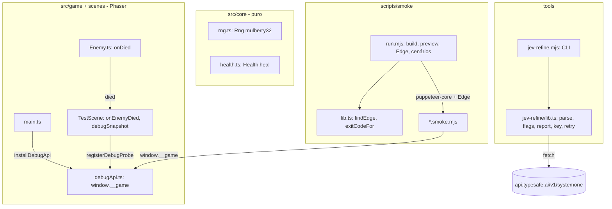

# Fundação da expansão — Design

**Spec**: `.specs/features/fundacao-harness-jev/spec.md`
**Status**: Approved

---

## Architecture Overview

Quatro peças independentes. Cada peça junta uma parte pura, testada no Vitest, com uma casca fina que só liga as coisas (AD-001).



---

## Code Reuse Analysis

### Existing Components to Leverage

| Component | Location | How to Use |
| --- | --- | --- |
| `Health` | `src/core/health.ts` | Ganha `heal(n)`; `receive`/`update` ficam como estão |
| Evento `died` do `EnemyBrain` | `src/core/enemyBrain.ts:54` | Já emitido uma única vez (guarda `isDead`); o `Enemy.handle` passa a repassar |
| `isDebug()` | `src/game/debug.ts` | Decide se o `window.__game` é instalado (só `?debug` no boot) |
| `newEntityId()` | `src/game/bodyTags.ts` | `enemy.id` é o `enemyId` da notificação e do snapshot |
| Padrão de harness do Verifier anterior | memória `surgue-harness-headless` | `puppeteer-core` + Edge com `--use-angle=swiftshader`, `keyboard.press(k, { delay: 50 })` |
| `Game.headlessStep(time, delta)` e `game.loop.sleep()` | `node_modules/phaser/src/core/Game.js:543`, `TimeStep.js:773` | Base do `step(ms)` determinístico |

### Integration Points

| System | Integration Method |
| --- | --- |
| Cena | `TestScene.create` registra a si mesma como probe do debug; `spawnEnemy` passa `onEnemyDied` ao `Enemy` |
| `main.ts` | Guarda o `Phaser.Game` criado e chama `installDebugApi(game)` |
| npm | `puppeteer-core` como devDependency; script `smoke` = `node scripts/smoke/run.mjs` |
| TypeSafe | `POST https://api.typesafe.ai/v1/systemone`, `model: "jev-latest"`, `Authorization: Bearer <chave>` |

---

## Components

### Rng
- **Purpose**: Sequência pseudoaleatória reproduzível por seed (AD-006).
- **Location**: `src/core/rng.ts`
- **Interfaces**:
  - `new Rng(seed: number)`: a seed é convertida para inteiro de 32 bits.
  - `next(): number` devolve um valor em [0, 1) (mulberry32).
  - `int(min: number, max: number): number` devolve um inteiro em [min, max], inclusive.
  - `chance(p: number): boolean` devolve `false` se `p <= 0`, `true` se `p >= 1`, e senão `next() < p`.
- **Dependencies**: nenhuma.

### Health.heal
- **Purpose**: Curar com teto (FND-05..07).
- **Location**: `src/core/health.ts`
- **Interfaces**: `heal(n: number): number`. Devolve o que foi restaurado; morto, `n <= 0` ou `n` não finito devolvem 0 sem mudar nada.

### Morte do inimigo para a cena
- **Purpose**: A cena fica sabendo de cada abate (FND-08).
- **Location**: `src/game/Enemy.ts`, `src/scenes/TestScene.ts`
- **Interfaces**:
  - O construtor do `Enemy` ganha `onDied?: (enemy: Enemy, x: number, y: number) => void`, chamado no evento `died`.
  - Getter `hp` no `Enemy`. Getter `dead` no `Player`.
  - `TestScene.onEnemyDied(enemyId, x, y)` guarda `enemyDied:<id>` em `debugEvents` (F1 usa esse gancho para contar abates).

### Debug API (`window.__game`)
- **Purpose**: Dar ao smoke leitura de estado e avanço determinístico (FND-09, FND-10, FND-22).
- **Location**: `src/game/debugApi.ts`. Não importa `phaser` como valor, então é testável em Node com fakes.
- **Interfaces**:
  - `interface DebugProbe { debugSnapshot(): GameSnapshot }`
  - `registerDebugProbe(probe: DebugProbe | null): void`: a cena se registra no `create` e se remove no `SHUTDOWN`.
  - `installDebugApi(game: SteppableGame, target: object, debugOn: boolean): void`. Só com `debugOn` define `target.__game = { snapshot, step }`. `SteppableGame = { loop: { sleep(): void; now: number }; headlessStep(time: number, delta: number): void }`.
  - `step(ms)`: na primeira chamada faz `game.loop.sleep()` e entra em modo manual. A partir daí o jogo só anda por `step`, com `ceil(ms / (1000/60))` chamadas de `headlessStep(t, 1000/60)` e `t` crescente.

### Smoke runner
- **Purpose**: `npm run smoke` versionado (FND-11, FND-12, FND-23).
- **Location**: `scripts/smoke/lib.ts` (puro) e `scripts/smoke/run.mjs` (CLI).
- **Interfaces**:
  - `findEdge(envPath: string | undefined, candidates: string[], exists: (p: string) => boolean): string | null`
  - `DEFAULT_EDGE_PATHS: string[]`
  - `exitCodeFor(results: { name: string; ok: boolean }[]): 0 | 1`
  - `failedNames(results): string[]`
  - `run.mjs` segue esta ordem:
    1. procura o Edge (não achou: imprime os caminhos e sai com 2);
    2. roda `npm run build`;
    3. sobe `vite preview --port <livre> --strictPort` e espera a resposta HTTP;
    4. abre uma página nova por cenário e chama o `default export async ({ page, baseUrl, assert })` de cada `*.smoke.mjs`, em ordem alfabética;
    5. derruba o servidor e sai com `exitCodeFor`.
- **Cenários**:
  - `no-debug.smoke.mjs`: sem `?debug`, o canvas existe e `window.__game` é `undefined`.
  - `boot.smoke.mjs`: o snapshot tem o player e 2 inimigos, e `step(500)` move a simulação.
  - `enemy-died.smoke.mjs`: golpes de debug (tecla 2) até a morte, depois exatamente um `enemyDied:<id>` por inimigo morto.

### Jev refine
- **Purpose**: Refinamento consultivo de ACs (FND-13..19, FND-24; AD-007).
- **Location**: `tools/jev-refine/lib.ts` (puro, só com os tipos DOM de `fetch`) e `tools/jev-refine.mjs` (CLI: lê arquivos e ambiente, grava o relatório).
- **Interfaces**:
  - `parseAcs(markdown): { id, story, criterion }[]`: lança `nenhum AC encontrado` se vier vazio.
  - `flagsFor(answers): string[]`, com os limiares do FND-14.
  - `buildRequest(ac): object`: perguntas `ambiguous`, `bundled`, `testable` (noul) e `precision` (score 0–3).
  - `formatReport(name, rows): string`
  - `readKey(env, envLocalText | null): string | null`
  - `askWithRetry(ac, key, fetchFn, sleepFn): Promise<Answers | { error: string }>`: repete em 429/529 esperando 1 s, 2 s e 4 s, e lança `JevAuthError` em 401/422.
  - A CLI roda até 4 ACs em paralelo.
- **Reuses**: o protótipo validado em 24/09 (scratchpad), com os limiares recalibrados.

---

## Data Models

```typescript
interface GameSnapshot {
  player: { x: number; y: number; hp: number; dead: boolean };
  enemies: { id: number; x: number; y: number; hp: number; state: EnemyState }[];
  events: string[]; // ex.: 'enemyDied:7'
}
interface AcRow { id: string; story: string; criterion: string }
interface Answers { ambiguous: number; bundled: number; testable: number; precision: number }
```

---

## Error Handling Strategy

| Error Scenario | Handling | User Impact |
| --- | --- | --- |
| Edge ausente | `run.mjs` imprime os caminhos procurados e sai com 2 (FND-12) | Mensagem clara, sem stack trace |
| Build ou preview falha | `run.mjs` sai com 1 e mostra a saída do comando | Smoke vermelho |
| Cenário lança exceção ou `assert` falha | O resultado desse cenário vira `ok: false`; os outros continuam | Lista de cenários que falharam (FND-11) |
| Sem chave da TypeSafe | Aviso, sem arquivo, saída 0 (FND-15) | Fluxo do Specify segue |
| 429/529 | Três novas tentativas com espera de 1, 2 e 4 s; depois a linha vira `erro <status>` (FND-16, FND-24) | Relatório parcial |
| 401/422 | `JevAuthError`, mensagem da API impressa, saída 1 (FND-17) | Corrigir chave ou payload |
| Spec sem AC | Saída 1 com `nenhum AC encontrado` | Aviso ao autor |

---

## Risks & Concerns

| Concern | Location (file:line) | Impact | Mitigation |
| --- | --- | --- | --- |
| Loop de tempo real correndo junto com o `step` deixa o smoke não determinístico | `node_modules/phaser/src/core/TimeStep.js:711` | Snapshot muda entre `step` e `snapshot` | `step` dorme o loop na primeira chamada (modo manual) |
| Hitstop congela a cena no meio do `step` | `src/scenes/TestScene.ts:145-167` | Poderia parecer travado | O `headlessStep` passa pelo PRE_UPDATE da cena, então o hitstop conta normalmente |
| Chave da TypeSafe exposta no chat da sessão de planejamento | - | Uso indevido | Só por ambiente e `.env.local` (FND-18, FND-19); recomendar rotação ao usuário |
| `types: []` no tsconfig tira os tipos do Node | `tsconfig.json` | `lib.ts` não compila se usar `process`/`fs` | Os `lib.ts` ficam puros; I/O só nos `.mjs`, que o `tsc` não checa |
| Scripts de smoke antigos nunca foram versionados | `.specs/features/visual-e-jogabilidade/validation.md:11` | Verificação não reproduzível | Esta feature versiona o harness |

---

## Tech Decisions

| Decision | Choice | Rationale |
| --- | --- | --- |
| Formato das ferramentas | Lógica em `.ts` pura + casca `.mjs` | O Node 24 remove tipos nativamente; o `tsc` e o Vitest checam a lógica sem `allowJs` |
| Avanço do smoke | `game.loop.sleep()` + `game.headlessStep` em passos de 1000/60 ms | Determinístico e sem renderizar |
| Cenários | `default export async ({ page, baseUrl, assert })` | Simples de escrever; o runner isola as falhas |
