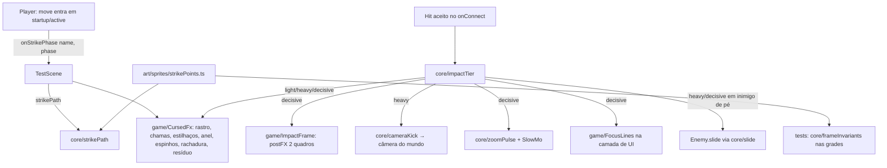

# Impacto Amaldiçoado Design

**Spec**: `.specs/features/impacto-amaldicoado/spec.md`
**Status**: Approved (aprovação da spec + regra de autonomia; abordagem escolhida pelo orquestrador)

---

## Architecture Overview

O padrão é o mesmo de sempre (AD-001). Toda conta vive em `src/core` e todo número em `src/data`, ambos puros e testados no Vitest: nível do impacto, espinhos com seed, caminho do rastro, passo à frente, deslizamento, tranco e zoom da câmera, invariantes das grades. Os adaptadores em `src/game` (`CursedFx`, `ImpactFrame`, `FocusLines`) só desenham o que o core devolve. A `TestScene` liga tudo num ponto único: o `onConnect` do golpe corpo a corpo do jogador.



**Abordagem escolhida** (das três avaliadas):
1. **Escolhida: efeitos procedurais (`Graphics` + partículas) em cima dos frames existentes redesenhados.** O rastro é um polígono afinado entre os pontos de golpe; o anel e os espinhos são `Graphics`. Cores da `PALETTE`, geometria na grade de 2 px (AD-009). Barato de ajustar e testável no core.
2. Descartada: sprites de efeito desenhados à mão por frame. Mais bonito parado, mas caro de produzir para 25 golpes e não acompanha o caminho real do membro.
3. Descartada: shader próprio (pipeline WebGL custom). Dá distorção real, mas quebra o fallback sem WebGL e foge do padrão de postFX do Phaser já usado no Kokusen.

---

## Code Reuse Analysis

### Existing Components to Leverage

| Component | Location | How to Use |
| --- | --- | --- |
| `Fx.burst`, `Fx.afterimage` | `src/game/fx.ts:70` | `CursedFx` segue o mesmo padrão de emissor que explode e se destrói com o timer da cena (pausa no hitstop: TRL-09 sai de graça) |
| `FxRegistry` | `src/core/fxRegistry.ts` | Conta os objetos vivos; `CursedFx` usa um registro próprio para o teto de 40 (EDG-03) e destrói tudo no SHUTDOWN (EDG-04) |
| ColorMatrix do Kokusen | `src/game/techFx/KokusenFx.ts:136` | Mesmo teste `renderer.type !== Phaser.WEBGL` e mesma forma de criar o postFX na câmera principal (IMP-11/12) |
| `SlowMo` | `src/core/slowMo.ts` | Ganha `trigger(scale?, ms?)`; reinicia sem empilhar (CAM-03/04/07/08) |
| Zoom do finalizador | `src/scenes/TestScene.ts:1471` (`finisherZoomMs`) | CAM-05 consulta `finisherZoomMs > 0` antes do micro-zoom |
| `rng.ts` | `src/core/rng.ts` | `impactSpikes(seed, count)` usa o RNG com seed (AD-006) |
| `pose()`, `compose()`, partes | `src/game/art/sprites/player.ts:297` | Os redesenhos usam as mesmas partes; o frame ganha 6 linhas de folga em cima |
| `pickHitReaction`, frames `hurt-body` | `src/core/hitReaction.ts`, `src/game/art/sprites/enemy.ts:317` | RCT-04 toca a reação `body` existente no inimigo atingido pelo choque |
| `tools/sprite-preview.mjs` | `tools/` | O worker de arte gera as pranchas e olha os PNG antes de fechar cada task |
| `fight-kit.mjs` | `scripts/smoke/` | O smoke final usa `waitFor`, `faceEnemy` e as URLs de debug |

### Integration Points

| System | Integration Method |
| --- | --- |
| `Player` | Novo callback `onStrikePhase(name, phase)` passado no construtor, chamado na troca de fase do `moves`; passo à frente aplicado na velocidade durante o startup |
| `TestScene.onConnect` (`:1311`) | Para `hit.ownerId === player.id` com `moveName` definido: `impactTier` → `CursedFx.impact`, `ImpactFrame`, câmera, deslizamento; nada de `fx.spark`/`fx.shake` (IMP-06, CAM-06) |
| `Enemy` | Novo `slide(dir, px, ms)` e `slideView`; a cena checa o choque com os outros inimigos a cada passo |
| Snapshot de debug | `fx.trails`, `fx.lastImpact`, `enemies[].slide` (TRL-10, IMP-16, RCT-06) |

---

## Components

### core/impactTier

- **Purpose**: Classificar o acerto em `light`, `heavy` ou `decisive` e gerar os espinhos.
- **Location**: `src/core/impactTier.ts`
- **Interfaces**:
  - `impactTier(hit: Pick<Hit, 'strength' | 'counter' | 'knockdown'>, ctx: { brokePosture: boolean }): ImpactTier`
  - `impactSpikes(seed: number, count: number): { angle: number; length: number }[]` (comprimento em [18, 30])
- **Reuses**: `rng.ts`

### core/strikePath

- **Purpose**: Converter os pontos de golpe em coordenadas do mundo e dar os parâmetros do rastro.
- **Location**: `src/core/strikePath.ts`
- **Interfaces**:
  - `strikeToWorld(pt: {col, row}, at: {x, footY}, facing: 1 | -1): Vec2`, usando a origem do frame (coluna `CENTER_COL`, pé na base) e a escala de texel 2
  - `strikeToBody(pt, bodyH): Vec2`, relativo ao centro do corpo com facing direito (POS-01)
  - `trailStyle(strength): { widthPx: 4 | 8; fadeMs: 140 | 220 }`

### core/stepIn

- **Purpose**: Passo à frente do golpe (POS-07..09).
- **Location**: `src/core/stepIn.ts`
- **Interfaces**: `class StepIn { start(strength, startupMs); update(dtMs, blocked: boolean): number /* px deste passo */ }`. O total é exatamente 4 ou 10 px; `blocked` zera o resto.

### core/slide

- **Purpose**: Deslizamento do inimigo (RCT-01/02/05).
- **Location**: `src/core/slide.ts`
- **Interfaces**: `class Slide { start(tier, dir); update(dtMs, blocked): number; get remainingPx(): number | null }` (24 px/180 ms ou 48 px/240 ms).

### core/cameraKick

- **Purpose**: Tranco direcional e pulso de zoom em tempo real (CAM-01/02).
- **Location**: `src/core/cameraKick.ts`
- **Interfaces**: `class CameraKick { kick(dirX, dirY); update(realDtMs): Vec2 }` (4 px, volta em 120 ms); `class ZoomPulse { start(); update(realDtMs): number }` (1.5 → 1.6 em 60 ms, segura 200, volta em 120).

### core/frameInvariants

- **Purpose**: Funções puras sobre grades para os testes POS-01..POS-06/POS-10.
- **Location**: `src/core/frameInvariants.ts`
- **Interfaces**: `isSingleComponent(grid)`, `touchesBottom(grid)`, `headLeftCol(grid)`, `topRowOf(grid, keys)`, `legThighShin(grid, legRows)`

### data/feel

- **Purpose**: Todos os números da feature num lugar (larguras, tempos, raios, contagens, teto 40, passo, deslizamento, câmera, linhas de foco).
- **Location**: `src/data/feel.ts`

### art/sprites/strikePoints

- **Purpose**: `STRIKE_POINTS: Record<string, { col: number; row: number }>` para todo frame `-wind`/`-hit` (TRL-01).
- **Location**: `src/game/art/sprites/strikePoints.ts`

### Redesenho e folga do frame

- **Purpose**: Dar espaço acima da cabeça e redesenhar gancho, chutes e pulo (POS-03..06, POS-10).
- **Location**: `src/game/art/sprites/player.ts`, `playerMoves.ts`
- **Mudança**: `PLAYER_FRAME_H` passa de 24 para 30 (6 linhas de folga em cima). `compose` desloca tudo 6 linhas para baixo, e os frames literais ganham 6 linhas vazias no topo. A origem continua no pé (`y: 1`), então nada se move no jogo. `playerTech.ts:282` já usa a constante.

### game/CursedFx

- **Purpose**: Desenhar rastro, chamas, estilhaços, anel, espinhos, rachadura e resíduo.
- **Location**: `src/game/CursedFx.ts`
- **Interfaces**: `trail(path: Vec2[], strength)`, `flameStart(at)`, `flameMove(at)`, `flameStop()`, `impact(tier, at, dir, seed)`, `crack(at)`, `residue(at)`, `get trails(): {tier, widthPx, ageMs}[]`, `destroyAll()`
- **Dependencies**: `PALETTE`, `data/feel`, `core/impactTier`

### game/ImpactFrame

- **Purpose**: postFX `impactFrame` por exatamente 2 quadros renderizados (IMP-11..14, EDG-05).
- **Location**: `src/game/ImpactFrame.ts`
- **Interfaces**: `trigger(swingId)`, que ignora um `swingId` repetido; conta os quadros no `POST_RENDER`, que também roda durante o hitstop. `get applied(): boolean`; `degraded` fica true sem WebGL.

### game/FocusLines

- **Purpose**: 24 linhas radiais na camada de UI por 180 ms reais, com um círculo livre de 120 px (FOC-01/02).
- **Location**: `src/game/FocusLines.ts`

---

## Data Models

```typescript
type ImpactTier = 'light' | 'heavy' | 'decisive';
interface StrikePoint { col: number; row: number }      // texels do frame final (30 linhas)
interface TrailView { tier: 'light' | 'heavy'; widthPx: number; ageMs: number }
interface LastImpact { tier: ImpactTier; impactFrame: boolean }
```

`Hit` ganha `swingId?: number`, um id por golpe iniciado, gerado no `Player`. Ele é usado em IMP-14.

---

## Error Handling Strategy

| Error Scenario | Handling | User Impact |
| --- | --- | --- |
| Frame sem ponto de golpe | Sem rastro; `console.warn` uma vez por nome (EDG-01) | Golpe sem rastro, sem quebrar |
| Sem WebGL | `ImpactFrame.degraded`; anel e espinhos seguem (IMP-12) | Sem o quadro de contraste |
| Muitos efeitos vivos | Acima de 40 pula estilhaços e resíduos (EDG-03) | Menos partículas em lutas cheias |
| Reinício da sala | `destroyAll()` no SHUTDOWN (EDG-04) | Nada sobra na tela |

---

## Risks & Concerns

| Concern | Location (file:line) | Impact | Mitigation |
| --- | --- | --- | --- |
| Testes de arte fixam a altura 24 | `tests/game/art.test.ts:216,240,280,306,1243,1280,1301` | Os testes quebram com a folga | Usam a constante `PLAYER_FRAME_H`, então acompanham. A task da folga roda a suíte de arte e ajusta só as expectativas literais de linha |
| `TestScene` grande (1643 linhas) | `src/scenes/TestScene.ts` | Mais acoplamento | A ligação fica num método novo `onMeleeImpact(hit, point, target)` chamado do `onConnect`; os efeitos moram em classes próprias |
| Hitbox do gancho a 18 px e 24×32 | `src/data/moves.ts:132` | POS-01 pode exigir ponto fora do desenho atual | A hitbox não muda (dificuldade); o desenho cresce até ela |
| Smokes antigos olham `fx.spark`/shake | `scripts/smoke/*.smoke.mjs` | Smokes de feel podem falhar | A task de ligação roda a suíte inteira e adapta só asserts de faísca do golpe do jogador |
| Passo à frente muda a distância do combo | `src/game/Player.ts:941` | Smokes de alcance podem errar por 4–10 px | O passo para no contato (POS-09); a suíte inteira roda no fim da fase |

---

## Tech Decisions

| Decision | Choice | Rationale |
| --- | --- | --- |
| Folga do frame | +6 linhas no topo (30 de altura) | O cabelo começa na linha 1; sem folga o punho do gancho nunca passa da cabeça |
| Contagem do impact frame | Quadros renderizados (`POST_RENDER`), não ms | 2 quadros é a linguagem do anime e funciona durante o hitstop |
| Tempo dos efeitos de mundo | Tempo de jogo (pausa no hitstop) | O congelamento do golpe segura o rastro aceso, como a estrela atual |
| Tempo da câmera e das linhas de foco | Tempo real | O tranco e o zoom precisam acontecer durante o hitstop |
