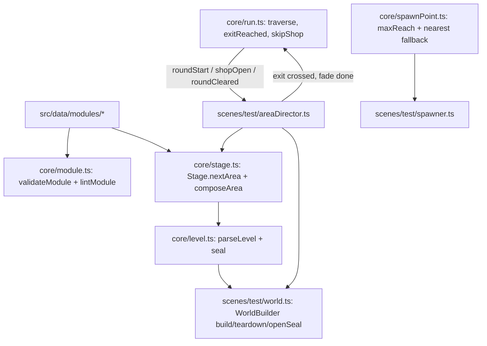

# Mundo modular — Design

**Spec**: `.specs/features/mundo-modular/spec.md`
**Status**: Approved (abordagem fixada pela spec aprovada em 07/10/2026: uma área por vez, reconstruída no lugar)

---

## Architecture Overview

Uma área por vez existe no mundo. A regra (formato do módulo, lint, sorteio, montagem, estados da run, escolha do
spawn) é pura em `src/core`/`src/data` (AD-001). A cena ganha dois adaptadores novos: `WorldBuilder`, que constrói e
destrói os objetos de uma área, e `AreaDirector`, que decide qual área construir a partir dos comandos da run, abre o
selo, detecta a saída e conduz o fade.



**Abordagens consideradas** (a spec já fixou a primeira):
1. **Reconstruir no lugar dentro da `TestScene` (escolhida).** Run, carteira, loadout, modificadores, energia e HUD
   continuam vivos; só os objetos da área são trocados.
2. Reiniciar a cena a cada área. Descartada: todo o estado da run é da cena, e carregá-lo pelo `registry` mexeria em
   dezenas de sistemas.
3. Uma faixa contínua com todas as áreas. Descartada: o mundo físico cresce sem limite e a konbini deixa de ser um
   lugar à parte.

### Fluxo de comandos (modo modular)

| Momento | Run | Cena (`AreaDirector`) |
| --- | --- | --- |
| `create` | `title` | constrói a área de fundo do título: só o `rua`, selado |
| J no título | `startRun` + `roundStart(1)` | `runDirector.onStartRun` reseta; `roundStart` → `Stage.nextArea(1)` → `rebuild` → player na coluna 3 → `fadeIn(250)` |
| último abate | `roundCleared` e estado `traverse` | `openSeal()` (corpo removido + efeito de 400 ms); a fatia de vida e a câmera lenta de hoje continuam |
| player cruza o selo | — | trava o input (neutro), `fadeOut(250)`; no fim do fade: `drainPickups()`, `dropHeld()`, `run.exitReached()` |
| `update` seguinte | `shopOpen(r)` (ou `roundStart(r+1)` com `skipShop`) | `shopOpen` → `rebuild(konbini)` → `fadeIn` → `shopDirector.openShop` |
| fechar a loja | `roundStart(r+1)` | `shopDirector.closeShop` passa por `fadeOut(250)` antes de `run.closeShop()`; `roundStart` → `rebuild` → `fadeIn` |
| rodada de chefe | `roundStart(5)` | `Stage.nextArea(5)` devolve `['santuario']`; o chefe nasce pelo `farthestPoint`, como hoje |

No modo sala (`?area=sala` ou `fxlab`) nada disso roda: a `TestScene` constrói a `LEVEL_1` como hoje, a run é criada
com `flow: 'sala'` e o `AreaDirector` fica inerte.

---

## Code Reuse Analysis

### Existing Components to Leverage

| Component | Location | How to Use |
| --- | --- | --- |
| `parseLevel`, `tileVariant`, `TILE` | `src/core/level.ts` | Lê a grade composta da área; ganha o `S` (selo) como retângulo à parte, nunca mesclado nos sólidos |
| `TerrainBuilder.buildTerrain` | `src/scenes/test/terrain.ts` | Vira parte do `WorldBuilder`: o mesmo desenho por variante e os mesmos corpos estáticos, agora lendo a grade da área e guardando as imagens para destruir |
| `buildBackground` | `src/game/art/background.ts` | Já recebe largura e altura; o `WorldBuilder` guarda as `Graphics` devolvidas e as destrói no teardown |
| `Rng` e streams por `seed ^ salt` | `src/core/rng.ts`, `src/core/run.ts` | Dois streams novos na run: `stageRng` (`^ 0x1f83d9ab`) e `slotRng` (`^ 0x5be0cd19`) |
| `pickSpawnPoint`, `farthestPoint` | `src/core/spawnPoint.ts`, `src/core/waves.ts` | Ganha `maxReach?: number` (padrão `Infinity`, então os testes atuais não mudam) e o fallback do ponto fora da câmera mais perto |
| `Drops.onPickupCollected` | `src/scenes/test/drops.ts` | O dreno da saída (TRV-07) chama a mesma função para cada pickup vivo: carteira, cura com teto, "+N" e eventos iguais aos de uma coleta |
| `Prop.destroyNow`, `Player.held` | `src/game/Prop.ts`, `src/game/Player.ts` | TRV-08: o objeto da mão é destruído e `held` vira `null` |
| `Pickups.clear`, `FloatTexts.clear`, `DroppedTools.clear` | `src/game/Pickups.ts`, `src/game/FloatTexts.ts`, `src/core/droppedTools.ts` | Teardown da área (ARE-11) |
| `ShopDirector.openShop/closeShop` | `src/scenes/test/shopDirector.ts` | A loja não muda; só o momento em que abre e o fade antes de fechar |
| `requireSpawnPoints` | `src/core/waves.ts` | Chamado para toda área de combate e de chefe; nunca para a konbini |
| `debugParam`, `debugIntParam` | `src/scenes/test/params.ts` | `modules=`; `area=sala` vale com ou sem `?debug` (o atalho para a sala é útil fora do debug também) |

### Integration Points

| System | Integration Method |
| --- | --- |
| `Run` (`src/core/run.ts`) | `RunOptions.flow: 'sala' \| 'modular'` (padrão `'sala'`, então todos os testes existentes valem); `RunOptions.skipShop`; estado `traverse`; `exitReached()`; getters `stageRng` e `slotRng` |
| `acceptsPlayerInput` | Passa a devolver `true` também em `traverse` |
| `RunDirector.applyRunCommand` | Repassa `roundStart`, `roundCleared` e `shopOpen` ao `AreaDirector` antes do tratamento de hoje (banner, recuperação, câmera lenta) |
| Banner "Rodada N concluída" (`runDirector.ts:235`) | Mostra também em `traverse` |
| `Player` | `spawn` deixa de ser `readonly`: `setSpawn(x, y)` e `placeAtSpawn()` (o `respawn` sem o fade e sem mexer na vida) |
| `Spawner.pickEnemySpawnPoint` | Passa `maxReach: SPAWN.reachPx` (900) só no modo modular, para a sala não mudar (LEG-01) |
| `CameraRig.followConfig` e `setBounds` | Já leem `s.level`; o `rebuild` chama `cameras.main.setBounds` com o tamanho novo e reposiciona o centro (`clampCenter`) |
| Snapshot (`src/scenes/test/snapshot.ts`, `src/game/debugApi.ts`) | Campo `area` (LEG-05), com `staticBodies` contado em `matter.world.localWorld.bodies` com `isStatic` |
| Smoke runner (`scripts/smoke/run.mjs`) | Envolve `page.goto` para acrescentar `area=sala` (LEG-03) |

---

## Components

### Módulo e lint — `src/core/module.ts`

- **Purpose**: Tipo do módulo, validação de formato (falha alto) e lint de level design (lista de erros).
- **Interfaces**:
  - `type ModuleKind = 'combat' | 'konbini' | 'boss'`; `type ModuleTheme = 'rua' | 'beco' | 'parque' | 'konbini' | 'santuario'`
  - `interface ModuleDef { id: string; kind: ModuleKind; theme: ModuleTheme; grid: readonly string[] }`
  - `validateModule(def: ModuleDef): void`: MDL-01..03. Mensagem: `Módulo "<id>": linha <r>, coluna <c>: <motivo>`.
  - `lintModule(def: ModuleDef): string[]`: MDL-04..09; vazio = passou. As regras MDL-06..08 valem para `combat` e `boss`.
- **Constantes**: `MODULE_ROWS = 17`, `MODULE_MIN_COLS = 16`, `MODULE_MAX_COLS = 48`, `FLOOR_ROWS = [15, 16]`,
  `WALK_ROW = 14`, `OPEN_MIN_COLS = 12`, `HEADROOM_ROWS = [9, 14]`.

### Catálogo — `src/data/modules/`

- `rua.ts` (40, `combat`, tema `rua`), `beco.ts` (20, `combat`), `parque.ts` (32, `combat`), `konbini.ts` (20,
  `konbini`, sem `E`), `santuario.ts` (40, `boss`), `index.ts` com `MODULES: Record<string, ModuleDef>` e
  `COMBAT_IDS` na ordem `['rua', 'beco', 'parque']` (é a ordem do sorteio).
- Cada módulo de combate tem pelo menos 2 `E` (um perto de cada borda, para o spawn fora da câmera ter opção dos dois
  lados), 1 ou 2 `p` e no máximo 1 `c`/`b` fixo. Sem `#` acima da linha 15 (MDL-05).

### Stage — `src/core/stage.ts`

- **Purpose**: Sortear os módulos de cada área e compor a grade final.
- **Interfaces**:
  - `class Stage { constructor(stageRng: Rng, slotRng: Rng, forced: readonly string[] | null); nextArea(round: number): AreaPlan }`:
    guarda o primeiro módulo da área anterior (ARE-05). `isBossRound(round)` → `['santuario']`. `forced` (ARE-12)
    ignora as regras de repetição, mas o chefe continua sendo o santuário.
  - `drawModules(rng, count, prevFirst, combatIds): string[]`: cada posição sorteia `rng.int(0, n − 1)` sobre
    `combatIds` sem o vizinho anterior (na posição 0, sem `prevFirst`). Depois aplica a regra de largura (ARE-06).
  - `composeArea(ids: readonly string[], modules, slotRng): AreaGrid`: concatena linha a linha; coluna 0 = `#` em
    todas as linhas; última coluna = `S` nas linhas 0 a 14 e `#` nas 15 e 16; `P` na coluna 3, linha 14; cada `p` vira
    `c` (< 0,4), `b` (< 0,8) ou `.` pelo `slotRng.next()`, da esquerda para a direita e de cima para baixo (SLT-01).
  - `konbiniArea(modules): AreaGrid`: a konbini com parede, selo sempre aberto (`.` no lugar de `S`) e `P`.
  - `parseModulesParam(raw: string | null, combatIds): string[] | null` (ARE-12/13).
  - `areaModeFor(search: string): 'modular' | 'sala'` (`area=sala` ou `fxlab` → `'sala'`; LEG-01, LEG-02, LEG-04).
- **Data**: `interface AreaPlan { modules: string[] }`; `interface AreaGrid { rows: string[]; spans: { id: string; theme: ModuleTheme; col0: number; col1: number }[]; sealCol: number | null }`.

### Level — `src/core/level.ts` (extensão)

- `S` vira `LevelData.seal: Rect | null`: um retângulo da coluna do selo, da linha do primeiro ao último `S`. Não entra
  em `solids` (a física do selo é removida sozinha) e o `tileVariant` trata `S` como vazio. Os demais caracteres e a
  mesclagem não mudam (os testes atuais continuam valendo).

### Run — `src/core/run.ts` (extensão)

- `RunState` ganha `'traverse'`. `RunOptions.flow` (`'sala'` padrão) e `RunOptions.skipShop` (`false` padrão).
- No passo 2 do `update`: com `flow === 'modular'`, `cleared` leva a `traverse` (e não a `intermission`) e emite
  `roundCleared`.
- `exitReached()` registra um pedido; o passo novo (entre os passos 3 e 4 de hoje) só o resolve em `traverse`: vai para
  `shop` + `shopOpen(round)`, ou, com `skipShop`, faz o que o `closeShop` faz hoje (`round++`, `WaveSpawner` novo,
  `roundActive`, `roundStart`). Fora de `traverse` o pedido é descartado (TRV-06). Dois pedidos no mesmo update viram
  uma transição.
- O passo 1 (morte) vale também em `traverse` (TRV-09). Em `traverse` nenhum timer avança e nenhum spawn sai (TRV-04).
- `stageRng`/`slotRng` criados no `startRun` com os outros streams.

### Spawn — `src/core/spawnPoint.ts` (extensão)

- `PickSpawnPointInput.maxReach?: number`. Candidatos = fora da câmera **e** `|x − playerX| ≤ maxReach` (≤, RCH-02).
  Sem candidato no alcance, mas com ponto fora da câmera: o fora da câmera mais perto do player, sem consumir o
  `rng.int` (o `rng.chance` continua sendo consumido sempre, AD-006). Sem nenhum fora da câmera: `farthestPoint`.
  A preferência pelas costas e o intervalo por ponto são aplicados sobre os candidatos no alcance (RCH-05).

### WorldBuilder — `src/scenes/test/world.ts` (novo; absorve o `TerrainBuilder`)

- **Purpose**: Construir e destruir tudo que pertence a uma área.
- **Interfaces**:
  - `build(rows: readonly string[], level: LevelData, themes?: AreaGrid['spans']): void`: tiles (imagens guardadas),
    corpos de terreno (empurrados em `s.terrain` **no mesmo array**: `Player`, `TechRunner` e o `Spawner` guardam a
    referência), corpo e imagem do selo, fundo (`buildBackground`), objetos (`new Prop`, mesmo código de hoje da
    `TestScene`).
  - `teardown(): void`: destrói tiles, fundo, corpos estáticos (`matter.world.remove`), selo, todos os `Prop`
    (`destroyNow`), e chama `pickups.clear()`, `floatTexts.clear()` e `droppedTools.clear()`; `s.terrain.length = 0` e
    `s.props.length = 0`.
  - `openSeal(): void`: remove o corpo do selo e toca o efeito de 400 ms (o frame `seal` some num tween de alfa com
    faíscas `cursedBit`); idempotente.
  - `get sealed(): boolean`, `get exitX(): number | null` (borda esquerda do selo em px).
- A sala usa o mesmo `build` com a `LEVEL_1` (sem selo), então só existe um caminho de construção.

### AreaDirector — `src/scenes/test/areaDirector.ts` (novo)

- **Purpose**: Ligar a run ao mundo no modo modular.
- **Interfaces**:
  - `constructor(s: TestScene, mode: 'modular' | 'sala')`; `get mode()`.
  - `onCommand(cmd: RunCommand): void`: `startRun` → `new Stage(run.stageRng, run.slotRng, forced)`;
    `roundStart` → `rebuild(stage.nextArea(round))`; `roundCleared` → `world.openSeal()`; `shopOpen` →
    `rebuild(konbini)`.
  - `update(dtMs: number): void`: em `traverse`, sem transição em curso, quando `player.body.position.x > exitX`:
    começa a transição de saída (TRV-05).
  - `get transitioning(): boolean`: lido pela `TestScene` para dar input neutro ao player (TRV-10).
  - `closeShopWithFade(): void`: usado pelo `ShopDirector` no modo modular.
  - `rebuild(grid)`: `world.teardown()` → `parseLevel(grid.rows)` → `s.level = level` → `requireSpawnPoints` (menos na
    konbini) → `world.build` → `player.setSpawn` + `placeAtSpawn` → `cameras.main.setBounds` + centro da câmera →
    `spawner.spawnLastUsed.clear()` → `fadeIn(250)`; evento de debug `areaBuilt:<ids>`.
  - Saída: `fadeOut(250)` → no `camerafadeoutcomplete`: dreno dos pickups (cada um por `drops.onPickupCollected`),
    `player.dropHeldForTransition()` e `run.exitReached()`.
- **Fundo do título**: no `create` do modo modular a cena constrói `composeArea(['rua'], …, new Rng(1))`, selado.

### Arte (P2) — `src/game/art/tiles.ts`, `src/game/art/background.ts`, `src/game/textures.ts`

- Uma folha de terreno por tema (`terrain-rua`, `terrain-beco`, `terrain-parque`, `terrain-konbini`,
  `terrain-santuario`), com as mesmas variantes do ENV-01 e só cores da `PALETTE`; o frame `seal` (talismã) numa folha
  `seal`. O `WorldBuilder` escolhe a folha pela coluna (`spans`). O fundo ganha uma faixa de cor por tema na camada
  próxima. Até o P2 entrar, o modo modular usa a folha `terrain` de hoje, então o P1 é jogável sem arte nova.

---

## Data Models

```typescript
// src/core/module.ts
type ModuleKind = 'combat' | 'konbini' | 'boss';
type ModuleTheme = 'rua' | 'beco' | 'parque' | 'konbini' | 'santuario';
interface ModuleDef { id: string; kind: ModuleKind; theme: ModuleTheme; grid: readonly string[] }

// src/core/stage.ts
interface AreaPlan { modules: string[] }
interface AreaGrid {
  rows: string[];
  spans: { id: string; theme: ModuleTheme; col0: number; col1: number }[];
  sealCol: number | null;
}

// src/core/level.ts
interface LevelData { /* campos de hoje */ seal: Rect | null }

// src/game/debugApi.ts (GameSnapshot)
area: {
  mode: 'modular' | 'sala';
  modules: string[];
  widthPx: number;
  heightPx: number;
  sealed: boolean;
  exitX: number | null;
  staticBodies: number;
};
```

Tuning novo em `src/data/tuning.ts`: `AREA = { fadeMs: 250, sealBurnMs: 400, playerCol: 3, minCols: 48, maxCols: 120 }`
e `SPAWN.reachPx = 900`.

---

## Risks & Concerns

| Concern | Mitigation |
| --- | --- |
| `s.terrain` e `s.props` são passados por referência ao `Player`, ao `TechRunner` e ao `Spawner`; reatribuir quebra colisões em silêncio | O teardown esvazia os arrays no lugar (`length = 0`); o smoke da travessia confere que o player fica de pé e acerta inimigos na área 2 |
| `Player.spawn` é `readonly` e o `resetForRun` usa o spawn da `LEVEL_1` | `setSpawn` + `placeAtSpawn`; no `startRun` o `roundStart` (que vem logo depois no mesmo update) reposiciona |
| `TestScene.ts` (461 linhas) já passa do teto de 400 e tem `create` com 163 linhas (exceções em `.oxlintrc.json`) | Todo código novo fica em `world.ts` e `areaDirector.ts`; a construção dos objetos sai da `TestScene` para o `WorldBuilder`, então ela encolhe |
| 35 smokes medem a geometria da sala | LEG-03 (o runner acrescenta `area=sala`); a suíte inteira roda no fim da feature |
| Smokes intermitentes conhecidos (`heal`, `armed`, `held-item`, `enemy-react`, backlog do ROADMAP) | Uma falha isolada é reexecutada; só conta como regressão se repetir em 2 de 3 execuções isoladas (critério já usado no projeto) |
| Fade da câmera disputa com o `fadeOut` da morte do player | A transição só começa em `traverse` com o player vivo, e a morte durante o fade de saída cancela a transição (o `gameOver` manda) |
| Matter pausado durante a loja (`shopDirector.openShop`) | O `rebuild` da konbini acontece antes do `openShop`; corpos criados com o mundo pausado ficam parados até o `resume`, que é o comportamento desejado |
| Spawn entre o `roundStart` e o primeiro quadro da área nova | O `rebuild` roda dentro do tratamento do `roundStart`, antes do próximo `run.update` que emite os `spawn`; os pontos já são os da área nova |
| Lição L-043 (adaptador que repassa config ao motor) | O smoke confere `cameras.main` (scroll máximo ≤ `widthPx − vista`) e o snapshot `staticBodies`, não só as funções puras |
| Lição L-010 (limite exato) | Testes em 900/901 px (RCH-02), 48/120 colunas (ARE-06), 16/48 colunas (MDL-01) e 12/11 colunas abertas (MDL-06) |
