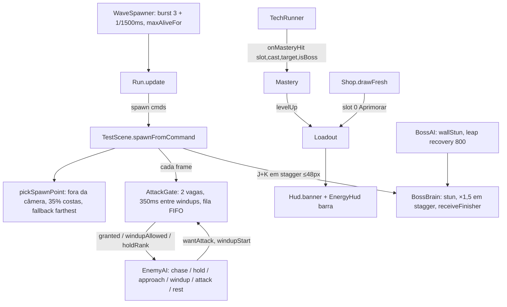

# Ritmo, economia e chefe — Design

**Spec**: `.specs/features/ritmo-economia-e-chefe/spec.md`
**Status**: Approved (o usuário delegou: "pode seguir")
**Branch**: `feat/ritmo-economia-e-chefe`

Decisões ativas respeitadas:
- AD-001: lógica pura em `src/core`, testada em Node.
- AD-006: RNG com seed; streams novos derivados da seed da run.
- AD-008: fluxo de branch.
- AD-013: aparências só visuais. Esta feature não mexe nelas.
- AD-014 (HP e dano fixos) e AD-016 (2 tokens) são **aplicadas aqui** em versão simples.

Lições confirmadas aplicadas:
- **L-010:** testar os dois lados de cada limiar (320 px, 96 px, 1500 ms, 350 ms, 15/25 pontos, 48 px, 800 ms).
- **L-043:** testar a chamada do adaptador que repassa o valor, não só o helper puro.

---

## Abordagens consideradas

| | Abordagem | Veredito |
| --- | --- | --- |
| **A (escolhida)** | `AttackGate` puro, consultado pela cena. A `EnemyAI` recebe `granted`, `windupAllowed` e `holdRank` como entrada e emite `wantAttack`. A cena libera a vaga quando o estado da IA sai de {`approach`, `windup`, `attack`}. | A IA continua pura e testável. O gate é um objeto pequeno que a F14 troca pelo `AttackDirector` sem mexer na IA. |
| B | Injetar o gate dentro da `EnemyAI`. | Acopla a IA a um estado global e dificulta testar inimigos isolados. |
| C | Fazer já o `AttackDirector` completo. | Fora do escopo (F14). |

No spawn, a escolha foi: o `WaveSpawner` decide **quantos** e **quando**; uma função pura `pickSpawnPoint` decide **onde**, e a cena a chama com a câmera e o jogador. O spawner hoje faz rodízio de pontos, mas não conhece a câmera.

---

## Architecture Overview



---

## Code Reuse Analysis

| Componente | Local | Uso |
| --- | --- | --- |
| `WaveSpawner`, `waveSize`, `farthestPoint` | `src/core/waves.ts` | Estender: nova fórmula, `maxAliveFor`, burst e gotejamento. `farthestPoint` vira o fallback do SPN-09 |
| `Run` (streams `variantRng`, `guardRng`, `shopRng`) | `src/core/run.ts` | Novo `spawnRng = new Rng(seed ^ 0x3c6ef372)`, no mesmo padrão. Não altera as sequências existentes |
| `EnemyAI` | `src/core/enemyAI.ts` | Reescrever a máquina: sai `patrol`, entram `hold` e `approach`. `interrupt` passa a voltar para `chase` |
| `scaleFor`, `DIFFICULTY` | `src/core/difficulty.ts`, `src/data/tuning.ts` | Só o tuning muda: `hpPerRound = 0`, `damagePerRound = 0` |
| `Shop.drawFresh`, `costOf`, `view` | `src/core/shop.ts` | Slot "Aprimorar" e `levelText` de técnica |
| `TECHNIQUE_SHOP_ENTRIES`, `techGate` | `src/data/shop.ts` | Preços e gate novos |
| `Modifiers(catalog)` | `src/core/modifiers.ts` | Só a construção na cena muda: `new Modifiers(FULL_SHOP_CATALOG)` |
| `Loadout.levelUp`, `levelOf`, `slotsView` | `src/core/loadout.ts` | Maestria e upgrade do chefe chamam `levelUp` |
| `TechRunner.onTechHit` (pontos de acerto nas linhas 239–537) | `src/game/TechRunner.ts` | Novo callback `onMasteryHit` chamado onde o alvo aceita o golpe |
| `BossAI` (`blocked`, `landed`) | `src/core/bossAI.ts` | Novo evento `wallStun`; descanso pós-pouso com `max(restMs, leap.recoveryMs)` |
| `BossBrain` (`stagger`, `applyDamage`) | `src/core/bossBrain.ts` | `stun(ms)`, multiplicador em `stagger`, `receiveFinisher()` |
| `tryFinisher`, hitstop e zoom do finalizador | `src/scenes/TestScene.ts:1155` | Novo ramo para o chefe com os mesmos efeitos |
| `Hud.banner` | `src/game/Hud.ts:255` | Banners `"{nome} Nv {n}!"` |
| `debugParam`, snapshot | `src/game/debugApi.ts` | Chaves `maxAlive` e `mastery`; campos novos no snapshot |

---

## Components

### 1. Onda e ritmo — `src/core/waves.ts` (+ `WAVE` em `tuning.ts`)

- **`WaveTuning`:** `{ base: 6, perRound: 2, max: 20, maxAliveBase: 5, maxAliveEvery: 2, maxAliveCap: 8, initialBurst: 3, trickleMs: 1500 }`. O campo `pointGapMs: 800` passa a ser usado só pelo `pickSpawnPoint`.
- **`waveSize(r, t)`** = `min(t.base + t.perRound·(r − 1), t.max)` (SPN-01).
- **`maxAliveFor(r, t)`** = `min(t.maxAliveBase + floor((r − 1) / t.maxAliveEvery), t.maxAliveCap)` (SPN-02).
- **`WaveSpawner`:**
  - Construtor: `(round, rng, t, maxAliveOverride?)`.
  - **Primeiro `update`:** libera `min(initialBurst, maxAlive, size)` ordens (SPN-03).
  - **Depois:** 1 ordem quando `elapsed − lastSpawnAt ≥ trickleMs`, `alive < maxAlive` e a fila não está vazia (SPN-04/05).
  - `SpawnOrder.point` deixa de existir para inimigo comum. O chefe continua usando `farthestPoint` na cena.
- **`Run`:** repassa `maxAliveOverride` (do `?debug&maxAlive=N`) e expõe `spawnRng` e `maxAlive`.

### 2. Escolha do ponto — `src/core/spawnPoint.ts` (novo)

```ts
pickSpawnPoint(o: {
  points: readonly { x: number }[]; viewLeft: number; viewRight: number; margin: number; // 32
  playerX: number; playerFacing: 1 | -1;
  lastUsedAt: ReadonlyMap<number, number>; nowMs: number; gapMs: number; // 800
  rng: Rng; preferBackChance: number; // 0.35
}): number
```

1. **Fora da câmera** = `x < viewLeft − margin || x > viewRight + margin`. Entre esses, remove os usados há menos de `gapMs`. Se sobrar nenhum, ignora o gap.
2. **`rng.chance(0.35)` consumido sempre**, para o stream ficar estável (AD-006). Se sair verdadeiro e houver pontos fora da câmera do lado oposto ao `playerFacing`, sorteia entre eles. Senão, sorteia entre todos os pontos fora da câmera.
3. **Nenhum ponto fora da câmera:** `farthestPoint` (SPN-09).
4. O sorteio usa `rng.int`.

A `LEVEL_1` ganha `E` nas colunas 1 e 38 da linha do chão, ficando com 4 pontos (SPN-06).

### 3. Limitador — `src/core/attackGate.ts` (novo)

```ts
class AttackGate {
  constructor(t: { maxActive: 2; minWindupGapMs: 350 })
  update(dtMs: number): void
  request(id: number): boolean        // entra na fila FIFO (idempotente); concede se ativos < 2 e id é o primeiro da fila
  isGranted(id: number): boolean
  windupAllowed(): boolean            // ≥ 350 ms desde o último windup
  noteWindup(id: number): void
  release(id: number): void           // libera a vaga ou sai da fila; idempotente
  queueOrder(): readonly number[]     // para o holdRank
  activeCount(): number
  reset(): void
}
```

- O número de inimigos em `windup|attack` nunca passa de 2 (LIM-01), porque a IA só entra em `windup` com `granted && windupAllowed` (LIM-02).
- **Liberação** (LIM-06): no mesmo frame em que o estado da IA sai de {`approach`, `windup`, `attack`} (golpe, ragdoll, morte, fim do descanso) e quando o inimigo é removido. O `startRun` chama `reset()` (EDG-03).

### 4. IA do inimigo — `src/core/enemyAI.ts`

- **Estados:** `chase | hold | approach | windup | attack | rest`. O estado `patrol` não existe mais (SPN-10).
- **Entrada:** `{ selfX, playerX, canAct, granted, windupAllowed, holdRank }`.
- **Eventos:** `windupStart | hitboxOn | hitboxOff | wantAttack`.
- **Ordem de decisão** com `canAct` (as fases `windup`, `attack` e `rest` funcionam como hoje; o fim de `rest` vai para `chase`):

| Condição | Estado e efeito |
| --- | --- |
| `granted` e `dist ≤ attackRange` e `windupAllowed` | `windup` (emite `windupStart`) |
| `granted` | `approach` rumo ao jogador a `chaseSpeed` |
| `!granted` e `dist ≤ holdRange` (96) | `hold`, emite `wantAttack` |
| senão | `chase`, a `chaseSpeed × (dist > 320 ? 1.6 : 1)` (SPN-11/12) |

- **Em `hold`** (LIM-07): o alvo é `holdDistance(k) = 64 + 24·k`, com `k = holdRank`. Com `|dx| < alvo − 8` ele se afasta; com `|dx| > alvo + 8` ele se aproxima, sempre a `chaseSpeed` e sempre olhando para o jogador.
- **`holdRank`** é calculado pela cena: posição do inimigo na `queueOrder()`, contando só os inimigos do mesmo lado do jogador. Isso garante LIM-05, porque ranks vizinhos ficam a 24 px.
- **`interrupt()`:** fecha a hitbox se estava aberta e vai para `chase`.
- **Tuning (`ENEMY_AI`):** saem `patrolRange`, `patrolSpeed` e `chaseRange`. Entram `holdRange: 96`, `holdBase: 64`, `holdStep: 24`, `holdTolerance: 8`, `farRange: 320`, `farSpeedMult: 1.6`.
- `Enemy.patrolSpeed` sai. Quem o usava passa a usar `chaseSpeed`.

**Ajuste de spec feito neste design:** o LIM-07 passa a dizer `holdDistance(k) ± 8`. A faixa fixa de 64–96 px não comporta 8 inimigos com 24 px entre si.

### 5. Economia e loja

- **`src/data/shop.ts`:**
  - preços do ECN-01;
  - `techGate(n)`: n ≥ 3 → 4; n ≥ 2 → 2; senão 1 (ECN-02/09).
- **`src/core/shop.ts` `drawFresh`:**
  - Com os dois slots vazios, mantém o TSH-05.
  - Senão, calcula as técnicas equipadas com `level < 3` e `techGate(level + 1) ≤ round` (as entradas técnicas do pool já filtradas por `eligible`). Se houver, sorteia uma com `rng.int` para o slot 0 e tira essa do pool antes de sortear os outros 2 slots (ECN-05/06/07).
- **`view`:** técnica com `levelText = Nv ${levelOf + 1}/3` (ECN-08).
- **`src/core/economy.ts`** (novo, pequeno): `expectedIncome(r, waveT, econ)`, para ECN-03/04.
- **`TestScene`:** `new Modifiers(FULL_SHOP_CATALOG)` (PRG).

### 6. Maestria — `src/core/mastery.ts` (novo)

```ts
class Mastery {
  constructor(t: { thresholds: { 1: 15, 2: 25 }; bossPoints: 3 })
  points(slot: 0 | 1): number
  threshold(level: 1 | 2 | 3): number | null   // null no Nv3
  registerHit(slot, level, castId, targetId, isBoss): { levelUp: boolean }  // dedup por (castId, targetId)
  resetSlot(slot): void
  reset(): void
  setPoints(slot, n): void                      // ?debug&mastery=N
}
```

- `levelUp: true` quando os pontos atingem o limiar do nível atual. A cena chama `loadout.levelUp(id)` e mostra o banner. Os pontos voltam a 0 (MST-03/04). No Nv3 não acumula (MST-05). Ignora o `techGate` (MST-06).
- **`TechRunner`** ganha o callback `onMasteryHit(slot, castId, targetId, isBoss)`, chamado em cada ponto onde hoje `receiveHit`/`receiveKokusen` devolve `true` ou aplica dano. O `castId` é um contador incrementado a cada conjuração iniciada.
- **`EnergyHud`:** barra de 2 px, com largura `round(slotW × pontos / limiar)`, sob cada slot ocupado com nível < 3 (MST-08).

### 7. Chefe

- **Tuning:** `BOSS.tier.hpBase = 400` (BFX-01); `BOSS.wallStunMs = 1500`; `BOSS.leap.recoveryMs = 800`; `BOSS.staggerDamageMult = 1.5`; `BOSS.finisher = { hpFraction: 0.12, rangePx: 48 }`.
- **`BossAI`:**
  - Investida que termina por `blocked`: emite `{ type: 'wallStun' }` e entra em `rest` (BFX-02).
  - Investida que termina por alcance máximo: descanso normal (BFX-03).
  - Depois de `landed`, o descanso dura `max(restMs, leap.recoveryMs)` (BFX-04).
- **`BossBrain`:**
  - `stun(ms)`: entra em `stagger` sem mexer na postura; ignorado em `roar`, `intro` e `dead` (EDG-05). Guarda `staggerCause: 'poise' | 'wall'`. Na saída, só restaura a postura ao máximo se a causa foi `poise`.
  - `receiveHit` em `stagger`: o dano vira `round(dano × 1,5)` (BFX-05).
  - `finisherReady`: fica `true` ao entrar em `stagger` e `false` depois do uso ou na saída.
  - `receiveFinisher()`: com `finisherReady`, aplica `round(0,12 × maxHp)` pelo `applyDamage` (pode matar, EDG-06), **sem** o ×1,5, e devolve os eventos. Sem `finisherReady`, devolve `[]` (BFX-06/07/08).
- **`Boss`:** reage ao evento `wallStun` chamando `brain.stun`; expõe `receiveFinisher` e `finisherReady`.
- **`TestScene.tryFinisher`:** se o chefe está vivo, em `stagger`, com `finisherReady` e a ≤ 48 px do centro, aplica o finalizador do chefe com o mesmo hitstop e zoom; senão, segue o fluxo atual.
- **Derrota do chefe:** sobe 1 nível na técnica equipada de menor nível abaixo de 3 (empate: slot 0) e mostra o banner (BFX-09/10).

### 8. Debug e snapshot — `src/game/debugApi.ts`

- **URL:** `maxAlive=N` (inteiro ≥ 1) e `mastery=N` (inteiro ≥ 0) só valem em debug; valor inválido é ignorado.
- **Snapshot ganha:**
  - `run.maxAlive`;
  - `attackers` (inimigos em `windup|attack`);
  - `gate: { active, queue }`;
  - `enemies[].ai`, que já existe e agora pode valer `hold` ou `approach`;
  - `techniques.slots[].mastery { points, threshold }`;
  - `boss.finisherReady`;
  - `camera.worldView { left, right }`, se ainda não existir.

---

## Data Models

```ts
interface WaveTuning { base; perRound; max; maxAliveBase; maxAliveEvery; maxAliveCap; initialBurst; trickleMs; pointGapMs }
interface SpawnOrder { k: number; atMs: number; kind: SpawnKind }   // point removido
type EnemyAIState = 'chase' | 'hold' | 'approach' | 'windup' | 'attack' | 'rest'
```

---

## Risks & Concerns

| Risco | Mitigação |
| --- | --- |
| **Smokes antigos** assumem 3 inimigos na rodada 1, 2 pontos (`x=624`/`1200`), patrulha e chefe com 600 de HP (`boss.smoke.mjs`, `fight-kit.approach`, `enemy-*`, `run-loop`, `drops`, `armed`) | Task própria (T14) para adaptar: `?debug&maxAlive=1` e asserções por fórmula em vez de literal. A ordem dos pontos muda (o índice 0 passa a ser a coluna 1), então o smoke do chefe passa a ler `farthestPoint`. Sem enfraquecer asserções de comportamento |
| **Testes de patrulha** em `tests/core/enemyAI.test.ts` testam um comportamento que a spec remove (SPN-10) | Reescrever junto com a IA (T6). Os casos de patrulha saem porque o requisito saiu, não para passar o gate. Fica registrado no commit |
| **Backlog:** mutante 70 fixo em `enemyAI.ts:120` | Os testes novos usam um tuning diferente de 35/70 (fecha o item do backlog) |
| **`heal.smoke` e `armed.smoke` intermitentes** | Fora do escopo. O Verifier só os considera se a falha mudar de natureza |
| **`TestScene.ts`** (1346 linhas) concentra muita ligação | Cada task de cena mexe numa parte isolada (spawn, gate, finalizador, maestria). Lógica nova só em `src/core` |
| **Desempenho** com 8 inimigos e ragdolls | 8 é o teto. O teto de 60 fragmentos vivos continua. Smoke mede que o `step` de 20 s não estoura o timeout |
