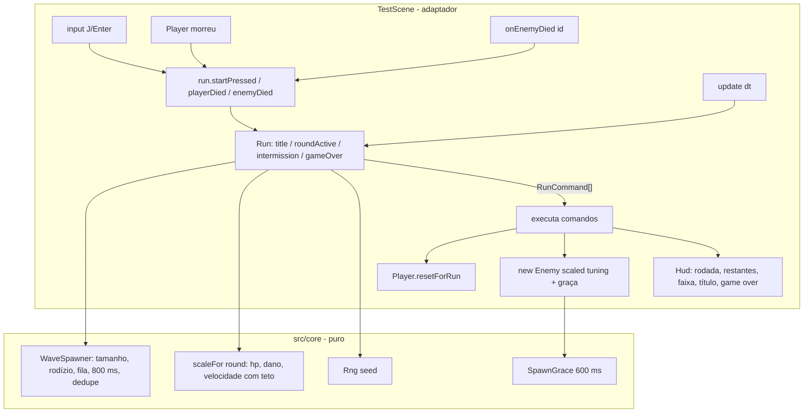

# Run, rodadas e dificuldade progressiva — Design

**Spec**: `.specs/features/run-e-rodadas/spec.md`
**Status**: Approved (abordagem "run puro no core" escolhida pelo usuário em 24/09)

---

## Architecture Overview

Toda regra de run, onda, tempo e dificuldade vive em `src/core` (AD-001). Cada módulo recebe `dt` e eventos e devolve comandos. A `TestScene` só traduz eventos do Phaser em chamadas ao `Run` e executa os comandos devolvidos. O sorteio passa pelo `Rng` com seed (AD-006).



**Ordem dentro do frame.** `playerDied` e `enemyDied` só registram o evento. O `Run.update(dt)` resolve tudo numa ordem fixa: morte do player primeiro (vai para `gameOver`), depois abates (podem limpar a rodada), depois os tempos. Isso cobre o edge case "player e último inimigo morrem no mesmo frame", sem depender da ordem dos callbacks do Matter.

---

## Code Reuse Analysis

### Existing Components to Leverage

| Component | Location | How to Use |
| --- | --- | --- |
| `Rng` | `src/core/rng.ts` | Um por run, criado com a seed; o `WaveSpawner` sorteia o `s` do WAVE-02 nele |
| `Health` | `src/core/health.ts` | Ganha `reset()`. O player usa `respawnMs: Infinity`, então o `update` nunca emite `respawn` (RUN-03) |
| `EnemyAI` `canAct` | `src/core/enemyAI.ts` | `canAct: false` já deixa o inimigo parado e sem golpe; o `SpawnGrace` só segura esse sinal (WAVE-09) |
| `EnemyBrain` / `EnemyAI` com tuning por construtor | `src/core/enemyBrain.ts`, `enemyAI.ts` | Recebem o tuning escalado em vez das constantes (DIF-04) |
| `onEnemyDied(id, x, y)` e `debugEvents` | `src/scenes/TestScene.ts` | Entrada de abate do `Run`; `spawnFx:<id>` entra na mesma lista (RHUD-08) |
| `window.__game` + `npm run smoke` | `src/game/debugApi.ts`, `scripts/smoke/` | Snapshot ganha `run` e `hud`; cenários novos e adaptados |
| Textura `smokeCurse` | `src/game/art/index.ts:49` | Fumaça amaldiçoada do spawn (`Fx.curseSmoke`) |
| `Hud` + `uiLayer` + `css()` da paleta | `src/game/Hud.ts` | Textos da run na camada de UI, com cores da paleta (RHUD-04/07) |
| `level.enemies` (pontos `E`) | `src/core/level.ts:24` | Pontos de spawn das ondas |

### Integration Points

| System | Integration Method |
| --- | --- |
| Loop da cena | `update` chama `run.update(dt)` e executa os comandos; o respawn de inimigo com `ENEMY_RESPAWN_MS` sai da cena (WAVE-05) |
| Input | Fora de `roundActive`/`intermission`, a cena passa ao `Player` um input neutro (RUN-08); `startPressed` vem de J/Enter via `JustDown` |
| Seed | `?seed=N` em `?debug`; senão `Date.now()` |
| Debug | `snapshot().run = { state, round, kills, alive, queued }` (RUN-09); `enemies[i].maxHp`/`damage` (DIF-04); `hud = { ignoredByMain, round, remaining, banner, center }` (RHUD-01..07) |

---

## Components

### difficulty (`src/core/difficulty.ts`)
- **Purpose**: Tuning do inimigo escalado pela rodada (DIF-01..06).
- **Interfaces**:
  - `multipliersFor(round: number): { hp: number; damage: number; speed: number }`. Rodada < 1 ou não inteira vira 1 (DIF-03).
  - `scaleFor(round: number, base: EnemyBase, t: DifficultyTuning): EnemyBase`, com `EnemyBase = { brain: EnemyTuning; ai: EnemyAITuning; attack: AttackStep }`. Arredonda `maxHp` e `damage` para inteiro e multiplica `patrolSpeed`/`chaseSpeed`.
- **Tuning**: `DIFFICULTY = { hpPerRound: 0.12, hpCap: 3.0, damagePerRound: 0.08, damageCap: 2.5, speedPerRound: 0.03, speedCap: 1.4 }` em `src/data/tuning.ts`.

### SpawnGrace (`src/core/spawnGrace.ts`)
- **Purpose**: Graça de 600 ms depois do spawn (WAVE-09).
- **Interfaces**: `new SpawnGrace(ms)`, `update(dtMs)`, `get active: boolean`. Fica ativo enquanto o tempo decorrido é menor que `ms`.

### WaveSpawner (`src/core/waves.ts`)
- **Purpose**: Onda de uma rodada (WAVE-01..04, 06..08).
- **Interfaces**:
  - `waveSize(round, t): number`, que devolve `min(t.base + (round − 1), t.max)`.
  - `requireSpawnPoints(level: { enemies: unknown[] }, name: string): void`. Sem ponto `E`, lança `Level "<name>" sem ponto de spawn E` (edge case).
  - `new WaveSpawner(round, pointCount, rng, t: WaveTuning)`, que sorteia `s = rng.int(0, pointCount − 1)`.
  - `update(dtMs): SpawnOrder[]`, com `SpawnOrder = { k, point, atMs }`. Emite o k-ésimo spawn no ponto `(s + k) mod P` quando há menos de `maxAlive` vivos e já passaram `pointGapMs` desde o último spawn naquele ponto. O primeiro spawn de cada ponto pode sair em `t = 0`.
  - `enemyDied(enemyId): boolean`. Devolve `true` só na primeira vez de cada id (WAVE-06).
  - Getters `alive`, `queued`, `kills`, `remaining` e `cleared`.
- **Tuning**: `WAVE = { base: 3, max: 12, maxAlive: 4, pointGapMs: 800 }`.

### Run (`src/core/run.ts`)
- **Purpose**: Máquina de estados da run (RUN-01..11).
- **Interfaces**:
  - `new Run(t: RunTuning, waveT: WaveTuning, pointCount: number)`, que começa em `title`.
  - `startPressed()`, `playerDied()`, `enemyDied(id)`: só registram.
  - `update(dtMs, seedForNewRun: () => number): RunCommand[]`: resolve na ordem morte do player → abates → tempos.
  - Getters `state`, `round`, `kills`, `summary`, `alive`, `queued`, `remaining`.
  - `acceptsPlayerInput(state): boolean`: `true` só em `roundActive` e `intermission` (RUN-08).
- **Comandos**:
  - `{ type: 'startRun' }`: reset do player e remoção dos inimigos restantes.
  - `{ type: 'roundStart', round }`: faixa `Rodada N`.
  - `{ type: 'spawn', point, round }`
  - `{ type: 'roundCleared', round }`
  - `{ type: 'gameOver', round, kills }`
- **Regras**:
  - Start em `title`: `startRun` + `roundStart(1)`.
  - Start em `gameOver`: igual, mas só depois de `gameOverLockMs` (RUN-11).
  - Rodada limpa: vai para `intermission` uma vez só (RUN-06). Após `intermissionMs`, `roundStart(N + 1)` (RUN-10).
  - Morte do player em `roundActive`: `gameOver` com a rodada atual. Em `intermission`: `gameOver` com a rodada recém-limpa (edge case).
  - Eventos fora de hora são ignorados (RUN-07).
- **Tuning**: `RUN = { intermissionMs: 2500, gameOverLockMs: 1000, spawnGraceMs: 600, bannerMs: 1500 }`.

### Health.reset (`src/core/health.ts`)
- `reset(): void` volta a hp cheio e vivo, e zera invulnerabilidade, atordoamento e respawn.

### Adaptadores
- **`Enemy.ts`**:
  - O construtor recebe `tuning: EnemyBase` e `graceMs`. `brain`, `ai`, garra e barra de vida usam o tuning recebido.
  - `canAct = brain idle && !grace.active`.
  - Novos getters `maxHp` e `damage`.
- **`Player.ts`**:
  - Usa `{ ...PLAYER_HEALTH, respawnMs: Infinity }`.
  - `resetForRun()`: larga o objeto da mão, volta ao spawn com velocidade 0, `health.reset()`, `initialMoveState()` e fade-in.
- **`Fx.ts`**: `curseSmoke(x, y)`, uma rajada com a textura `smokeCurse`.
- **`Hud.ts`**:
  - `setRun({ round, remaining })`, `banner(text, ms)`, `setCenter(lines | null)`.
  - `debugState()` devolve `{ ignoredByMain, round, remaining, banner, center }`.
  - Tudo com cores da paleta e dentro da `uiLayer`.
- **`TestScene.ts`**:
  - Cria o `Run` e executa os comandos.
  - Controla o input (RUN-08) e liga J/Enter ao `startPressed`.
  - Monta o snapshot com `run`, `hud`, `maxHp` e `damage`.
  - Marca `spawnFx:<id>` e chama `fx.curseSmoke` a cada spawn.
  - O respawn antigo sai.

---

## Data Models

```typescript
type RunState = 'title' | 'roundActive' | 'intermission' | 'gameOver';
interface RunSummary { round: number; kills: number }
type RunCommand =
  | { type: 'startRun' }
  | { type: 'roundStart'; round: number }
  | { type: 'spawn'; point: number; round: number }
  | { type: 'roundCleared'; round: number }
  | { type: 'gameOver'; round: number; kills: number };
interface EnemyBase { brain: EnemyTuning; ai: EnemyAITuning; attack: AttackStep }
// GameSnapshot (debugApi) ganha:
//   run: { state; round; kills; alive; queued }
//   hud: { ignoredByMain: boolean; round: string; remaining: string; banner: string | null; center: string[] | null }
//   enemies[i]: + maxHp, damage
```

---

## Error Handling Strategy

| Error Scenario | Handling | User Impact |
| --- | --- | --- |
| Level sem ponto `E` | `requireSpawnPoints` lança no `create`, com o nome do level | Erro de desenvolvimento visível no console |
| Evento fora de hora (abate em `title`, start em `roundActive`) | Ignorado pelo `Run` (RUN-07) | Nenhum |
| Abate duplicado do mesmo id | `enemyDied` devolve `false` e não conta (WAVE-06) | Nenhum |
| J apertado ao morrer | Trava de 1000 ms no `gameOver` (RUN-11) | O resumo sempre aparece |

---

## Risks & Concerns

| Concern | Location (file:line) | Impact | Mitigation |
| --- | --- | --- | --- |
| Constantes fixas do inimigo em vários pontos | `src/game/Enemy.ts:34,76,125,128,173` | O escalonamento vale só em parte | Task única troca todos por `this.tuning`; smoke confere `maxHp`/`damage` da rodada 2 |
| Respawn automático embutido no `Health` | `src/core/health.ts` (`update`) | O player renasceria na run | `respawnMs: Infinity` no player; `Health` e os testes HP-04 ficam intactos |
| Smokes da F0 supõem inimigos no boot | `scripts/smoke/boot.smoke.mjs`, `enemy-died.smoke.mjs` | Quebram com a tela de título | Adaptados para começar a run antes; asserções de FND-08/09 mantidas; decisão na spec |
| Eventos `spawnFx` entram na mesma lista de `events` | `scripts/smoke/enemy-died.smoke.mjs:65-71` | A checagem "nenhum evento novo" falharia | O cenário filtra `enemyDied:` nessa checagem, que é o que o FND-08 cobre |
| Graça de 600 ms congela o inimigo no `boot.smoke` | `scripts/smoke/boot.smoke.mjs` | `step(500)` não veria movimento | O cenário avança 1200 ms |
| Hitstop pausa o `time` da cena | `src/scenes/TestScene.ts` (`freeze`) | Timers do Phaser pausariam | Os tempos da run rodam no `Run.update(dt)`, que já não roda no hitstop (congelamento consistente) |

---

## Tech Decisions

| Decision | Choice | Rationale |
| --- | --- | --- |
| Onde ficam os tempos (2500, 800, 600, 1000 ms) | No core, contados por `dt` | Testáveis em Node e congelados junto com o hitstop |
| Resolução de eventos do frame | Registrar e resolver no `update` (morte do player primeiro) | Determinístico, sem depender da ordem dos callbacks |
| Dedupe de abate | Por `enemyId` no `WaveSpawner` | O id já existe (`newEntityId`) e é o mesmo do `onEnemyDied` |
| Respawn do player | `respawnMs: Infinity` | Não muda o `Health` nem os testes antigos |
