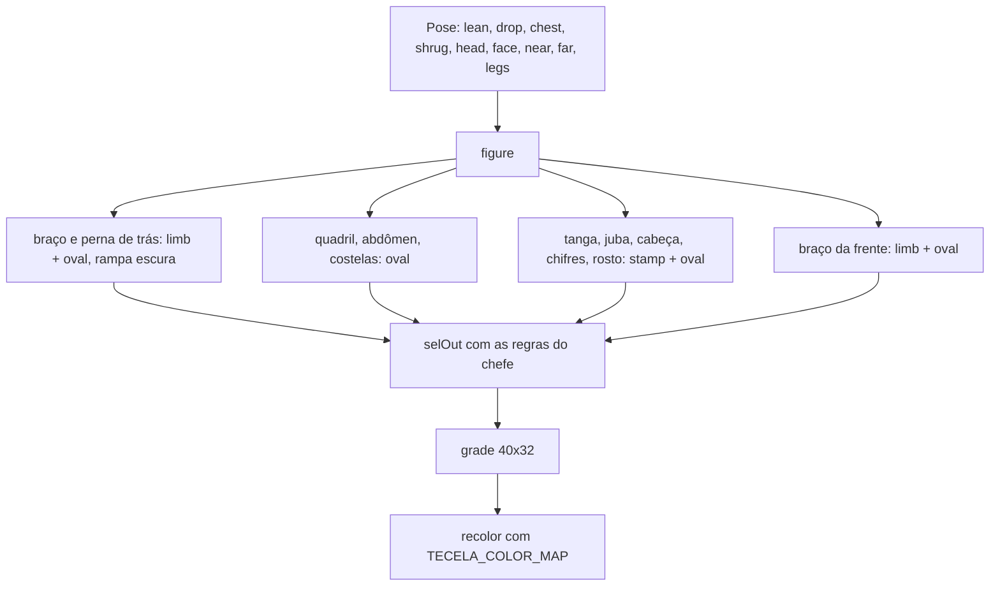

# Chefes desenhados e acabamento de golpes e objetos — Design

**Spec**: `.specs/features/sprite-chefes-e-acabamento/spec.md`
**Status**: Draft (o usuário não revisou; as escolhas estão nas Assumptions da spec com "Confirmed? n")
**Decisões de base**: AD-001 (dados puros no Vitest), AD-002 (grades + paleta única, sem tint), AD-012 (sel-out, frame e proporção do player fixos), AD-013 (3 aparências do inimigo), AD-017 (paleta de 42). Nova: AD-018.

## 1. Módulos

| Módulo | Muda | Papel |
| --- | --- | --- |
| `src/game/art/sprites/boss.ts` | reescrito | Primitivas `paint`, `oval`, `limb`, `stamp`; `Pose` + `figure(pose)`; `deadFigure()`; `BOSS_FRAMES` com 20 frames; `TECELA_COLOR_MAP`; `BOSS_ANIMS` como `AnimDef` com `durations`; `PROJECTILE_FRAME` e `SHOCKWAVE_FRAME` desenhados à mão |
| `src/game/art/sprites/player.ts` | `armStraight`, `legStraight` | Mesmas 5 linhas e `len` colunas; com `len` ≥ 12 o contorno de baixo sobe no antebraço e na canela |
| `src/game/art/sprites/playerMoves.ts` | `armPalm`, `armElbow`, `legDown`, `legRaised` (novo) | Palma derivada do `armStraight`; cotovelo em ponta; pisão com sapato; chute alto em diagonal a partir do quadril |
| `src/game/art/sprites/props.ts` | grades `CHAIR`, `BOTTLE` | Madeira + aço na cadeira; vidro, brilho e rótulo na garrafa |
| `src/game/art/sprites/tools.ts` | grades `KNIFE`, `CLUB` | Fio, guarda e cabo na faca; cravos e empunhadura no porrete |
| `src/game/art/sprites/enemy.ts` | `EnemyKit.rimFrom`, partes do bruto, pose do `hurt-uppercut` | Borda do `impact` só a partir da cabeça; punho arredondado; corpo fora do chão no `hurt-uppercut` |
| `tests/game/art.test.ts`, `tests/game/registerAnims.test.ts` | testes novos | Um bloco por story, 1:1 com os ACs |

Nenhum adaptador Phaser muda: `Boss.animate` já chama `anims.play(bossAnimKey(...), true)` e `createArt` já registra `BOSS_ANIMS` nas duas texturas.

## 2. Chefe por pose articulada (AD-018)



- `paint(canvas, shade, ramp)` pinta uma forma com 4 tons pela luz (`LIGHT`, de cima e um pouco pela esquerda) e põe um contorno `k` em volta, por cima do que já estava. Camadas sobrepostas ficam separadas por linha; o `selOut` troca a linha interna pela cor do material (`m` pele, `h` juba, `v` pano, `L` osso, `K` no resto).
- `oval` e `limb` são as duas formas. `limb(a, b, ra, rb)` é um segmento com raio que varia de `ra` a `rb`.
- `stamp` sobrepõe as partes desenhadas à mão: `HORN_NEAR`, `HORN_FAR`, `TUFTS`, `FACES` (`calm`, `glow`, `roar`, `dizzy`), `FOOT`, `FOOT_FAR`, `CLOTH`.
- Rampas: pele `A a z m`; pele de trás `a z z m`; juba `H j h h`; ferro `S s N n`; energia `w U u v`.
- Juntas relativas ao tronco: ombros em `chest + (−7,5; −3)` e `chest + (7,5; −2,5)`; cabeça em `chest + (3,8; −5,8)`; quadril em `(19 + lean/2; 22 + drop)`, limitado a 27 para o agachamento não enterrar o pé.
- O braço de trás (lado direito da tela) é o que avança nos golpes; o da frente recua. O frame nunca passa da coluna 39 nem da linha 0.

### Frames e poses

| Frame | Pose |
| --- | --- |
| `idle`, `idle-1`, `idle-2`, `idle-3` | Base; tronco desce 1; tronco desce 1 e ombros sobem 1; ombros sobem 1 |
| `windup-charge`, `-1` | Recua 2 e agacha 2, punho da frente erguido atrás, o de trás em guarda, cabeça baixa, olho aceso; o segundo frame recua 1 (tremor) |
| `charge`, `charge-1` | Avança 4, cabeça baixa à frente, braço de trás esticado; alterna a passada (`stride-a`, `stride-b`) |
| `windup-leap`, `-1` | Agacha 5 (depois 6), punhos perto do chão, pés afastados |
| `leap` | Braços erguidos, boca aberta, pés recolhidos |
| `windup-volley`, `-1` | Braço da frente erguido com a esfera sobre a mão; a esfera pulsa (raio 1,8 e 2,8) |
| `volley`, `volley-1` | Braço de trás esticado à frente; depois recolhido para cima |
| `roar`, `roar-1` | Peito cheio, braços abertos, boca aberta; o segundo frame desloca 1 texel (tremor) |
| `stagger`, `stagger-1` | Agacha 3, cabeça caída, olhos `> <`, língua de fora; balança de um lado para o outro |
| `dead` | De bruços no chão, cabeça à direita: costas, juba, chifres e um braço estendido |

### Animações (`BOSS_ANIMS`)

| Anim | Frames | Durações (ms) | Repeat |
| --- | --- | --- | --- |
| `idle` | `idle`, `idle-1`, `idle-2`, `idle-3` | 480, 160, 480, 160 | −1 |
| `windup-charge` / `windup-leap` / `windup-volley` | `<nome>`, `<nome>-1` | 90, 90 | −1 |
| `charge` | `charge`, `charge-1` | 80, 80 | −1 |
| `volley` | `volley`, `volley-1` | `BOSS.volley.intervalMs / 2` cada | −1 |
| `roar` | `roar`, `roar-1` | 80, 80 | −1 |
| `stagger` | `stagger`, `stagger-1` | 220, 220 | −1 |
| `leap`, `dead` | 1 frame | — | 0 |

`boss.ts` importa `BOSS` de `src/data/tuning.ts` (dados puros) só para o ciclo da rajada.

## 3. Membros do player

`armStraight(len)` com `len` ≥ 12, `sleeve = len − 7`, `upper = ceil(sleeve / 2)`:

```
kkkkkkkkkkkkkkkk.      contorno de cima
ksssssNNNNNskpppk      braço claro em cima, antebraço N, punho de manga s
kNNNNonnnnnNkppPk      dobra do cotovelo (o)
knnnnnkkkkkkkPPxk      o contorno de baixo sobe no antebraço
kkkkkk.......kkk.      vazio sob o antebraço; punho com 5 de altura
```

`legStraight(len)` segue a mesma ideia com `leg = len − 6`: coxa de 3, joelho `o`, canela de 2 e sapato `KKs` (sola clara virada para o alvo) com 5 de altura. Abaixo de 12 colunas as duas funções devolvem a forma antiga.

`legRaised(len, rise)` monta a mesma perna coluna a coluna, subindo `rise` linhas do quadril ao pé, e contorna com `k` tudo que encosta no preenchimento. No `chuteAlto-hit` entra `legRaised(21, 12)` no lugar de `legStraight(21)`, no mesmo ponto `(9, 2)`: a ponta do pé fica onde estava e o quadril passa a ser a origem da perna.

## 4. Inimigos

- `EnemyKit.rimFrom?: number` (padrão 3, o valor atual): primeira linha do tronco que recebe a borda branca do `impact`. No bruto vale 6, o topo da cabeça.
- Punho do bruto: `B_ARM_REACH`, `B_ARM_HANG` e `B_ARM_FWD` ganham cantos arredondados e a linha dos nós dos dedos. Na ponta do `B_ARM_REACH` só as 3 linhas do meio ficam opacas.
- `hurt-uppercut`: `drop` −3 e `legLift` 3 (eram −2 e 2), `lean` −1 (era −2) e os braços ficam para baixo (`near` [0, −1], `far` [−2, −1]). O corpo sai 3 texels do chão em vez de só inclinar para trás como no `hurt-head-a`. Braço erguido foi descartado: no corcunda e no bruto o `armWindup` tem a cor de alerta do preparo.

## Code Reuse Analysis

| Componente | Local | Uso |
| --- | --- | --- |
| `selOut`, `SelOutConfig` | `src/game/art/selOut.ts` | Regras do chefe, sem mudar a função |
| `AnimDef`, `animFrameConfigs` | `src/game/art/sprites/player.ts` | `BOSS_ANIMS` passa a ser `AnimDef` (o tipo `BossAnimDef` some) |
| `registerAnims` | `src/game/art/index.ts` | Já repassa `duration` e `repeat`; só ganha teste com `BOSS_ANIMS` |
| `cutShards`, `withOutline` | `props.ts`, `tools.ts` | Estilhaços e frames de raridade saem das grades novas sem mudança |
| `componentSizes`, `bboxOf`, `interiorK` | `tests/game/*.test.ts` | Mesmas medidas dos testes do player e do inimigo |

## Risks & Concerns

| Concern | Location (file:line) | Impact | Mitigation |
| --- | --- | --- | --- |
| `play(key, true)` recomeça uma animação que terminou | `src/game/Boss.ts:357` | Animação de uma volta piscaria ao recomeçar | Toda animação de 2+ frames do chefe é laço; `leap` e `dead` têm 1 frame (BAN-02 a BAN-05) |
| Teste antigo da Tecelã compara só o `idle` | `tests/game/art.test.ts:644` | Um frame fora do mapa passaria | BSP-11 compara todos os frames com o recolor exato |
| `withOutline` troca todo `k` pela cor da raridade | `src/game/art/sprites/tools.ts:12` | Um `k` de detalhe interno viraria contorno colorido | As grades novas usam `k` só no contorno; detalhe escuro usa `K` |
| Linha de base de bbox do player (±2) e SPF-03 | `tests/game/art.test.ts:904`, `tests/game/playerConsistency.test.ts:158` | Membro novo pode deslocar a caixa ou o centro do uniforme | Membros mantêm 5 linhas e `len` colunas; protótipo rodado: 428 testes de `tests/game` passam |
| Smokes `heal` e `armed` intermitentes; máquina com pouca memória | `scripts/smoke/` (handoff do STATE.md) | Suite completa pode cair por motivo alheio | Gate final roda só `boot` e `boss*` (os que tocam a arte nova) |
| O chefe não tem `sprite-preview` | `tools/sprite-preview.mjs:16` | UAT de arte depende de script avulso | Fora de escopo (spec); pranchas antes/depois em `docs/art/` |

## Tech Decisions

| Decisão | Escolha | Razão |
| --- | --- | --- |
| Volumes do chefe | Pintados por código, com partes à mão por cima | AD-018 |
| Braço que ataca | O de trás (lado da frente do corpo) | Silhueta limpa: nada cruza o tronco |
| Esfera do preparo | Chaves do pano (`U`, `u`, `v`) | Roxa no Oni; na Tecelã vira novelo creme sem quebrar o BSP-11 |
| Afinar por baixo | O contorno de baixo sobe; o de cima fica reto | Mantém a linha do ombro ao punho e o rastro (SPR-14) no lugar |
