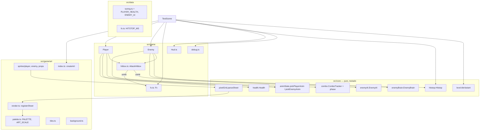

# Visual, efeitos e jogabilidade — Design

**Spec**: `.specs/features/visual-e-jogabilidade/spec.md`
**Status**: Approved

---

## Abordagem

Três jeitos de ter pixel art sem arte externa, todos entregando o mesmo escopo:

| | A. Grades de texto → canvas em tempo de execução **(recomendada)** | B. Script de build gera PNGs versionados | C. Desenho vetorial com `Graphics` por frame |
| --- | --- | --- | --- |
| Como | Sprite = linhas de texto (1 caractere = 1 cor da paleta); ao iniciar, `textures.createCanvas` pinta os frames e registra frames nomeados | Um script Node transforma as grades em PNGs em `public/`, e a cena faz `preload` | `scene.add.graphics()` + `generateTexture` com retângulos por parte do corpo |
| Prós | Uma só fonte de verdade; o parser é puro e testável (ART-02); zero asset; trocar por PNG depois é carregar as mesmas chaves | PNGs editáveis em Aseprite; carrega como arte "real" | Menos código de parser |
| Contras | Custo de ~ms na inicialização (desprezível: < 100 frames pequenos) | Dois caminhos (grade e PNG) que podem divergir; passo de build extra | Não é pixel art de verdade; formas genéricas e difícil de validar a paleta |

**Escolha: A.** Mantém a regra do projeto (lógica pura em `src/core` testada em Node, sem downloads) e torna ART-01/02/03 verificáveis por teste. A abordagem B continua possível depois: o render já produz os mesmos frames nomeados.

---

## Architecture Overview



**Fluxo do frame (`TestScene.update`)**:
1. `dt = min(delta, MAX_FRAME_MS)`.
2. `hitstop.update(dt)`. Enquanto congelado: `matter.world` pausado, `anims.pauseAll()`, `tweens.pauseAll()`, `time.paused = true`, e o `update` de Player/Enemy/Prop não roda (os timers de combo, IA e vida também congelam). Ao descongelar, retoma tudo.
3. Player, inimigos, objetos e HUD.

**Contato → efeitos**: `AttackHitbox` e `Prop` já chamam `target.receiveHit(hit)`. Um callback `onConnect(hit, point)` injetado pela cena dispara `fx.spark(point, kind)` e `hitstop.trigger(HITSTOP_MS[strength])`. O ponto de contato é o centro da interseção entre a hitbox e os bounds do alvo, calculado no adaptador.

**Duas câmeras**: `main` (zoom 1,5, segue o player) desenha o mundo; `ui` (zoom 1, fixa) desenha só o HUD. Cada objeto é ignorado pela câmera que não é a dele (`camera.ignore`). Sem isso, o zoom da câmera principal também amplia e desloca o HUD, mesmo com `scrollFactor 0`.

---

## Code Reuse Analysis

### Existing Components to Leverage

| Component | Location | How to Use |
| --- | --- | --- |
| `ComboTracker` | `src/core/combo.ts` | Ganha só o getter `phase` (`'idle'\|'startup'\|'active'\|'recovery'\|'window'`); o frame do golpe sai da fase, não do relógio (CHR-02) |
| `EnemyBrain` | `src/core/enemyBrain.ts` | Sem mudança; `state === 'idle'` libera a IA; `hitstun`/`ragdollStun` interrompem (AI-04) |
| `stepMovement(..., locked)` | `src/core/movement.ts` | `locked = atacando \|\| atordoado` (HP-03) |
| `makeHitGate`, `Hit`, `normalize` | `src/core/hit.ts` | Golpe do inimigo usa o mesmo gate (AI-05) |
| `Filters.hitbox` + `routeContact`/`tagBody` | `src/core/collision.ts`, `src/game/bodyTags.ts` | A hitbox do inimigo acerta `PLAYER` pela máscara que já existe; o próprio inimigo é o dono |
| `PropMachine.holderGone()` | `src/core/props.ts` | Largar objeto ao morrer (HP-04) |
| `openHitbox/placeHitbox/closeHitbox` | `src/game/Player.ts` | Extraídos para `AttackHitbox` e reusados pelo inimigo |
| `TEX` | `src/game/textures.ts` | Mantidas as chaves; `createPlaceholderTextures` é substituída por `createArt` |
| `parseLevel` | `src/core/level.ts` | `tileVariant` lê as mesmas `rows` |
| Harness headless | scratchpad (`harness.mjs`) | Smoke de cada task de adaptador |

### Integration Points

| System | Integration Method |
| --- | --- |
| Matter | `world.pause()/resume()` no hitstop; o corpo do inimigo recebe `setVelocity` só em x pela IA |
| Phaser Animations | `anims.create` com frames nomeados da textura de canvas; golpes por `setFrame` direto |
| Câmeras | `cameras.main` (mundo) + `cameras.add()` (HUD) com `ignore` cruzado |

---

## Components

### pixelGrid (puro)
- **Purpose**: validar e interpretar folhas de sprite escritas como texto.
- **Location**: `src/core/pixelGrid.ts`
- **Interfaces**:
  - `parseSheet(name: string, frames: Record<string, readonly string[]>, colors: ReadonlySet<string>): ParsedSheet`. Lança erro com `name` para linhas desiguais, caractere desconhecido ou frames de tamanhos diferentes (ART-02).
  - `ParsedSheet = { name; width; height; frames: { key: string; cells: (string | null)[][] }[] }` (`null` = transparente, caractere `.`).
- **Dependencies**: nenhuma.

### palette + render
- **Location**: `src/game/art/palette.ts`, `src/game/art/render.ts`
- **Interfaces**:
  - `PALETTE: Readonly<Record<string, number>>` (≤ 32 entradas, caractere → cor), `PALETTE_KEYS`, `ART_SCALE = 2`.
  - `registerSheet(scene, textureKey, sheet: ParsedSheet): void`: um canvas com os frames lado a lado, cada texel pintado como um bloco `ART_SCALE × ART_SCALE` com `fillRect`, e `texture.add(frameKey, 0, x, 0, w, h)` por frame.
- **Reuses**: `TEX` para as chaves.

### sprites / tiles / background
- **Location**: `src/game/art/sprites/player.ts`, `enemy.ts`, `props.ts`, `src/game/art/tiles.ts`, `src/game/art/background.ts`, `src/game/art/index.ts`
- **Interfaces**:
  - Cada módulo de sprite exporta `*_FRAMES: Record<string, readonly string[]>`.
  - `createArt(scene)` faz o parse e registra tudo, gera as partes do ragdoll recortando frames do inimigo (CHR-04) e os fragmentos dos objetos (PRP-01).
  - `buildBackground(scene, widthPx, heightPx)` cria as 3 camadas com `scrollFactor` 0,1/0,3/0,6 (ENV-02).
  - `tileFrameFor(variant, tx, ty)` escolhe o frame do tile, com variação por hash da posição.

### animState (puro)
- **Location**: `src/core/animState.ts`
- **Interfaces**:
  - `pickPlayerAnim(i: PlayerAnimInput): PlayerAnim` com `i = { hurt; attack: { name: 'jab'|'cross'|'kick'|'swing'|'throw'; phase } | null; grounded; vx; vy; holding }`, precedência de CHR-01.
  - `attackFrame(name, phase): 'wind'|'hit'|'recover'`, com `hit` exatamente em `active` (CHR-02).
  - `pickEnemyAnim(i: { brain: EnemyState; ai: EnemyAIState; moving: boolean }): EnemyAnim` (CHR-03).

### hitstop (puro)
- **Location**: `src/core/hitstop.ts`
- **Interfaces**: `class Hitstop { trigger(ms): void; update(dtMs): void; get frozen(): boolean; reset(): void }`. `trigger` fica com o maior entre o restante e o novo (FX-02).

### health (puro)
- **Location**: `src/core/health.ts`
- **Interfaces**:
  - `class Health { constructor(t: HealthTuning); receive(damage): 'ignored'|'hurt'|'died'; update(dtMs): HealthEvent[]; get hp; get max; get invulnerable; get staggered; get dead }`.
  - `HealthTuning = { maxHp; invulnMs; staggerMs; respawnMs }`.
  - `HealthEvent = 'staggerEnd'|'invulnEnd'|'respawn'` (HP-01..04).

### enemyAI (puro)
- **Location**: `src/core/enemyAI.ts`
- **Interfaces**:
  - `class EnemyAI { constructor(t: EnemyAITuning, spawnX); update(dtMs, s: { selfX; playerX; canAct: boolean }): AIOutput; interrupt(): AIEvent[]; get state(): EnemyAIState }`.
  - `EnemyAIState = 'patrol'|'chase'|'windup'|'attack'|'rest'`.
  - `AIOutput = { vx: number /* px/s */; facing: 1|-1; events: AIEvent[] }`, com `AIEvent = 'windupStart'|'hitboxOn'|'hitboxOff'`.
  - `canAct = brain.state === 'idle' && !brain.isDead`. Com `canAct` falso, `vx = 0`, e um preparo ou golpe em andamento é interrompido (AI-04).

### AttackHitbox (adaptador)
- **Location**: `src/game/hitbox.ts`
- **Interfaces**: `class AttackHitbox { constructor(scene, ownerId, onConnect); open(shape, hitFor: () => Hit, facing); follow(x, y, facing); close(); get isOpen }`. Visível só em debug (FIX-02/04).
- **Reuses**: o código atual de `Player.openHitbox/placeHitbox/closeHitbox`.

### Fx (adaptador)
- **Location**: `src/game/fx.ts`
- **Interfaces**: `spark(x, y, kind: 'light'|'heavy'|'prop')`, `dust(x, y)`, `afterimage(sprite)`, `shake(strength)`. Cores vindas da `PALETTE`.

### debug
- **Location**: `src/game/debug.ts`
- **Interfaces**: `isDebug(): boolean` (`?debug` inicial, F1 alterna), `onDebugChange(cb)`. A cena só registra 1, 2 e H dentro de `if (isDebug())` (FIX-01).

### Hud
- **Location**: `src/game/Hud.ts`
- **Interfaces**: `new Hud(scene, uiCamera)`, `setPlayerHp(hp, max)`, `showControls(ms)`, `toggleControls()` (HUD-01/03). A barra de vida do inimigo fica em `Enemy`, na câmera do mundo (HUD-02).

---

## Data Models

```typescript
// src/data/tuning.ts (acréscimos)
export const PLAYER_HEALTH: HealthTuning = { maxHp: 100, invulnMs: 700, staggerMs: 200, respawnMs: 1000 };
export const PLAYER_KNOCKBACK = 180; // px/s horizontal no recuo
export const ENEMY_AI: EnemyAITuning = {
  patrolRange: 48, patrolSpeed: 35, chaseRange: 200, chaseSpeed: 70,
  attackRange: 40, windupMs: 450, attackMs: 120, restMs: 800,
};
export const ENEMY_ATTACK: AttackStep = { name: 'garra', damage: 12, strength: 'light', force: 4,
  startupMs: 0, activeMs: 120, recoveryMs: 0, hitbox: { offsetX: 20, offsetY: -2, width: 24, height: 20 } };

// src/data/fx.ts
export const HITSTOP_MS: Record<Strength, number> = { light: 50, heavy: 90 };
```

---

## Error Handling Strategy

| Error Scenario | Handling | User Impact |
| --- | --- | --- |
| Grade de sprite inválida | `parseSheet` lança erro com o nome do sprite; os testes de dados rodam todas as folhas | Erro aparece no `npm test`, nunca no jogo |
| Chave de frame inexistente numa animação | `createArt` verifica se todo frame citado em `anims.ts` existe e lança erro na inicialização | Tela de erro no console em desenvolvimento |
| Morte do player com objeto na mão | `PropMachine.holderGone()` antes do respawn | Objeto cai no chão |
| Reinício durante hitstop | `hitstop.reset()` + `world.resume()` + `anims.resumeAll()` no `create` e no SHUTDOWN | Cena nova começa normal |

---

## Risks & Concerns

| Concern | Location (file:line) | Impact | Mitigation |
| --- | --- | --- | --- |
| `Player.ts` já tem 211 linhas e ganhará animação, vida e dano | `src/game/Player.ts:1` | Classe difícil de manter | Extrair `AttackHitbox` (T18) e manter a escolha de animação no `animState` puro |
| O zoom da câmera afeta objetos com `scrollFactor 0` | `src/scenes/TestScene.ts` (HUD atual) | HUD deslocado/ampliado | Câmera de UI separada com `ignore` cruzado |
| Sensores e zonas por `body.bounds` erram (Matter alarga o AABB pela velocidade) | lição da feature anterior; `src/game/Player.ts` `touchesTerrain` | Hitbox/ponto de contato errado | Ponto de contato e hitbox do inimigo usam posição + tamanho, nunca `bounds` |
| Camada de adaptadores sem teste automatizado | `src/game/**` | Regressão visual passa no gate | Toda regra nova vai para `src/core` com testes; smoke headless por task |
| Hitstop por pausa global pode deixar o mundo pausado se a cena reiniciar no meio | `TestScene` | Jogo travado depois do R | Reset no `create` e no SHUTDOWN (tabela acima) |
| O sprite do inimigo (36 px de largura) é maior que o corpo (22) | `src/game/Enemy.ts` | Golpe "acerta antes de encostar" visualmente | Silhueta desenhada com o tronco dentro dos 22 px centrais; braços só se estendem no frame de ataque |

---

## Tech Decisions (feature-local)

| Decision | Choice | Rationale |
| --- | --- | --- |
| Frame do golpe | Escolhido pela fase do `ComboTracker`, não por tempo de animação | Garante CHR-02 de forma determinística |
| Fonte do HUD | `Text` do Phaser em `monospace` na câmera de UI (zoom 1) | Fonte bitmap exigiria glifos com acento pt-BR; fora do spec |
| Poeira/faísca | `add.particles` + `explode` (API 3.60+ já usada no projeto) | Reuso do padrão de `Ragdoll.dissolve` |
| Variação de tile | Hash determinístico de (tx, ty) | Sem aleatoriedade entre reinícios |
| Ragdoll | Partes recortadas de frames do inimigo | CHR-04 sem desenhar duas vezes |
